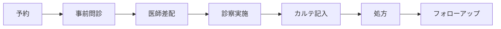

# 🏥 オンライン診療システム開発 学習ガイド

## 📚 このガイドについて

このガイドは、ファストドクター主催「オンライン診療AI活用ハッカソン」の参加者向けに作成された学習教材です。高校生から大学院生の皆さんが、医療ドメインの基本知識を習得し、実践的なシステム開発に取り組めるよう構成されています。

### 対象者

- プログラミング経験のある高校生〜大学院生
- 医療知識は限定的でもOK
- オンライン診療システムの開発に興味がある方

### 学習目標

1. オンライン診療の基本的な流れと用語を理解する
2. 医療システム開発に必要な技術スタックを習得する
3. AI技術を活用した課題解決のアプローチを学ぶ
4. チーム開発でのコミュニケーション手法を身につける

## 🗺️ 学習ロードマップ

### 第1部：医療ドメイン知識（推奨学習時間：1-2時間）

- [ ] [オンライン診療用語集](./オンライン診療用語集.md)を読んで基本用語を理解する
- [ ] SOAP形式（医療記録の標準形式）について理解する
- [ ] オンライン診療の法規制・ガイドラインの基本を把握する
- [ ] 医師・患者それぞれの課題を理解する

### 第2部：技術スタック学習（推奨学習時間：1-2時間）

技術的な詳細は[プロジェクトREADME](../../README.md)を参照してください。

- [ ] React + TypeScript + shadcn/uiの基礎を理解する
- [ ] Hono + Cloudflare Workersの開発環境を把握する
- [ ] Drizzle ORMを使ったデータベース操作を学ぶ
- [ ] CloudFlare Worker AIの基本的な使い方を理解する

### 第4部：ハッカソン実践（推奨学習時間：1時間）

- [ ] [ハッカソン心構えスライド](./hackathon-mindset-slides.md)で成功戦略を学ぶ（Marp対応）
- [ ] 課題発見から解決策考案のプロセスを理解する
- [ ] チーム開発でのコミュニケーション手法を習得する
- [ ] AI開発ツールの効果的な活用法を学ぶ

## 🎯 重点学習ポイント

### 1. オンライン診療の基本フロー

### 2. 主要なステークホルダーと課題

#### 👨‍⚕️ 医師の課題
- カルテ記載と診察の両立が困難
- 重要情報の聞き漏らしリスク
- 診察後のカルテ作成に時間がかかる

#### 🤒 患者の課題
- 症状を正確に伝えることが難しい
- 医学用語が理解できない
- 診察後の不安（薬の飲み方等）

#### 🏢 運営側の課題
- 医師の効率的な配置（差配）が難しい
- 診察品質の標準化
- 緊急性の判断

### 3. AI活用の可能性が高い領域

1. **事前問診の高度化**
   - 症状からの疾患予測
   - 追加質問の自動生成
   - 緊急度の自動判定

2. **診察支援**
   - リアルタイム音声認識
   - 医療用語の自動抽出
   - 重要情報のハイライト

3. **カルテ作成支援**
   - 音声からのSOAP形式自動生成
   - 医学用語の正確な記載
   - 診察サマリーの自動作成

## 📝 学習の進め方

1. **まず全体像を把握**：このガイドを通読して学習範囲を理解
2. **基礎から順番に**：医療用語→技術スタック→実践の順で学習
3. **手を動かして学ぶ**：サンプルコードを実際に動かしてみる
4. **チームで議論**：学んだことをチームメンバーと共有

## ✅ 学習完了チェックリスト

### 医療ドメイン知識
- [ ] SOAP形式を説明できる
- [ ] オンライン診療の基本的な流れを説明できる
- [ ] 主要な医療用語（問診、診察、処方等）を理解している
- [ ] オンライン診療の法的制約を把握している

### 技術スキル
- [ ] React + TypeScriptで画面を作成できる
- [ ] Hono + Cloudflare WorkersでAPIを作成できる
- [ ] データベースにテーブルを追加できる
- [ ] WebSocketでリアルタイム通信を実装できる

### AI活用スキル
- [ ] CloudFlare Worker AIの基本的な使い方が分かる
- [ ] 音声認識APIを実装できる
- [ ] 自然言語処理の基本的なユースケースを理解している
- [ ] プロンプトエンジニアリングの基礎を理解している

### チーム開発スキル
- [ ] Gitでのブランチ運用ができる
- [ ] プルリクエストの作成・レビューができる
- [ ] 効率的なタスク分担の方法を理解している
- [ ] チーム内でのコミュニケーション方法を確立している

## 🚀 次のステップ

1. [オンライン診療用語集](./オンライン診療用語集.md)から学習を開始
2. 興味のある技術スタックのガイドを選んで深掘り
3. 実際にベースラインシステムを動かしてみる
4. チームでアイデアを出し合い、実装計画を立てる

---

**Note**: このガイドは継続的に更新されます。フィードバックや質問があれば、Slackチャンネルまでお寄せください。