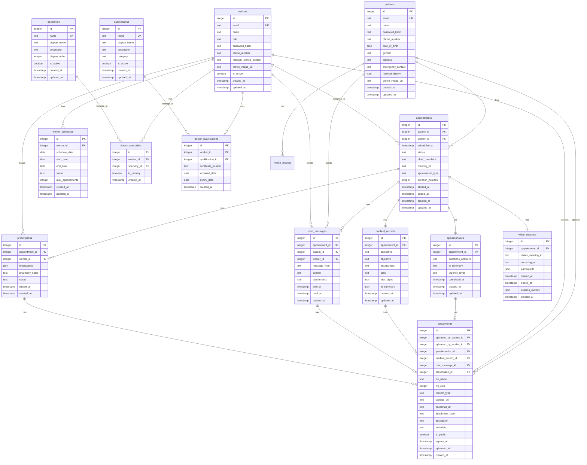
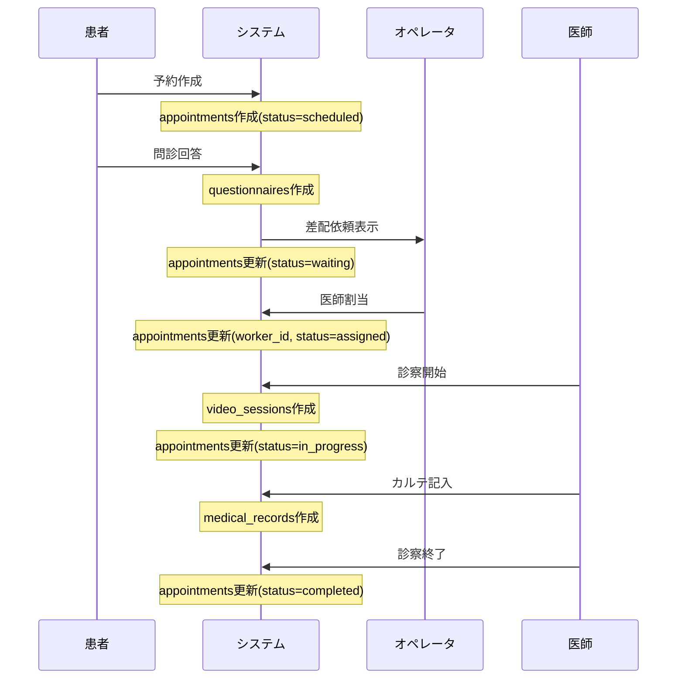
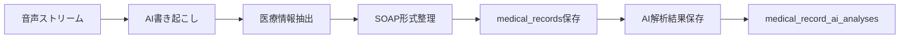

# データベース設計書 - オンライン診療システム

## 概要

本書は、オンライン診療システムのデータベース設計を定義します。Drizzle ORMを使用し、開発環境ではSQLite、本番環境ではCloudflare D1を使用する前提で設計されています。患者（patients）と医療従事者（workers）は別テーブルで管理します。

## 1. 設計方針

### 1.1 基本方針

- **分離ユーザーモデル**: 患者と医療従事者を別テーブルで管理（patients, workers）
- **拡張性**: ハッカソン参加者が機能追加しやすい設計
- **パフォーマンス**: インデックスの適切な配置とクエリ最適化
- **データ整合性**: 外部キー制約による参照整合性の確保

### 1.2 命名規則

- テーブル名: 複数形のsnake_case（例: `patients`, `appointments`）※Drizzle ORMの慣例に従う
- カラム名: snake_case（例: `created_at`, `patient_id`）
- 主キー: `id`（自動採番）
- 外部キー: `関連テーブル名（単数形）_id`（例: `patient_id`, `worker_id`）
- JSON型フィールド: Zodスキーマによる型定義（詳細は `database-design-json-types.md` 参照）

## 2. ER図



## 3. テーブル定義詳細

### 3.1 patients（患者）

患者情報を管理するマスターテーブル。

```typescript
export const patients = sqliteTable('patients', {
  id: integer('id').primaryKey({ autoIncrement: true }),
  email: text('email').notNull().unique(),
  name: text('name').notNull(),
  passwordHash: text('password_hash').notNull(),
  phoneNumber: text('phone_number'),
  dateOfBirth: integer('date_of_birth', { mode: 'timestamp' }),
  gender: text('gender', { enum: ['male', 'female', 'other'] }),
  address: text('address'),
  emergencyContact: text('emergency_contact'), // JSON: {name, relation, phone}
  medicalHistory: text('medical_history', { mode: 'json' }),
  // JSON形式: { allergies: [], medications: [], conditions: [] }
  profileImageUrl: text('profile_image_url'),
  createdAt: integer('created_at', { mode: 'timestamp' }).notNull().defaultNow(),
  updatedAt: integer('updated_at', { mode: 'timestamp' }).notNull().defaultNow(),
});
```

**インデックス:**

- `idx_patients_email` (email)

### 3.2 workers（医療従事者）

医師、オペレータ、管理者を含む医療従事者の情報。

```typescript
export const workers = sqliteTable('workers', {
  id: integer('id').primaryKey({ autoIncrement: true }),
  email: text('email').notNull().unique(),
  name: text('name').notNull(),
  role: text('role', {
    enum: ['doctor', 'operator', 'admin'],
  }).notNull(),
  passwordHash: text('password_hash').notNull(),
  phoneNumber: text('phone_number'),
  medicalLicenseNumber: text('medical_license_number'), // 医師のみ必須
  profileImageUrl: text('profile_image_url'),
  isActive: integer('is_active', { mode: 'boolean' }).notNull().default(true),
  createdAt: integer('created_at', { mode: 'timestamp' }).notNull().defaultNow(),
  updatedAt: integer('updated_at', { mode: 'timestamp' }).notNull().defaultNow(),
});
```

**インデックス:**

- `idx_workers_email` (email)
- `idx_workers_role` (role)
- `idx_workers_is_active` (isActive)

### 3.3 appointments（予約）

診療予約の中核テーブル。

```typescript
export const appointments = sqliteTable('appointments', {
  id: integer('id').primaryKey({ autoIncrement: true }),
  patientId: integer('patient_id')
    .notNull()
    .references(() => patients.id),
  workerId: integer('worker_id').references(() => workers.id), // 担当医師
  scheduledAt: integer('scheduled_at', { mode: 'timestamp' }).notNull(),
  status: text('status', {
    enum: ['scheduled', 'waiting', 'assigned', 'in_progress', 'completed', 'cancelled'],
  })
    .notNull()
    .default('scheduled'), // 'scheduled'→'waiting'→'assigned'→'in_progress'→'completed'
  chiefComplaint: text('chief_complaint'),
  meetingId: text('meeting_id'), // Amazon Chime SDK用
  appointmentType: text('appointment_type', {
    enum: ['initial', 'follow_up', 'emergency'],
  }).default('initial'),
  durationMinutes: integer('duration_minutes').default(30),
  startedAt: integer('started_at', { mode: 'timestamp' }),
  endedAt: integer('ended_at', { mode: 'timestamp' }),
  createdAt: integer('created_at', { mode: 'timestamp' }).notNull().defaultNow(),
  updatedAt: integer('updated_at', { mode: 'timestamp' }).notNull().defaultNow(),
});
```

**インデックス:**

- `idx_appointments_patient_id` (patientId)
- `idx_appointments_worker_id` (workerId)
- `idx_appointments_status` (status)
- `idx_appointments_scheduled_at` (scheduledAt)

### 3.4 questionnaires（問診票）

AI支援問診の内容を保存。

```typescript
export const questionnaires = sqliteTable('questionnaires', {
  id: integer('id').primaryKey({ autoIncrement: true }),
  appointmentId: integer('appointment_id')
    .notNull()
    .unique()
    .references(() => appointments.id),
  questionsAnswers: text('questions_answers', { mode: 'json' }).notNull(),
  // JSON形式: { questions: [{ id, text, answer, timestamp }] }
  aiSummary: text('ai_summary'),
  urgencyLevel: text('urgency_level', {
    enum: ['low', 'medium', 'high', 'critical'],
  }),
  completedAt: integer('completed_at', { mode: 'timestamp' }),
  createdAt: integer('created_at', { mode: 'timestamp' }).notNull().defaultNow(),
  updatedAt: integer('updated_at', { mode: 'timestamp' }).notNull().defaultNow(),
});
```

### 3.5 medical_records（診察記録）

SOAP形式の診察記録。

```typescript
export const medicalRecords = sqliteTable('medical_records', {
  id: integer('id').primaryKey({ autoIncrement: true }),
  appointmentId: integer('appointment_id')
    .notNull()
    .unique()
    .references(() => appointments.id),
  subjective: text('subjective'), // S: 主観的所見
  objective: text('objective'), // O: 客観的所見
  assessment: text('assessment'), // A: 評価
  plan: text('plan'), // P: 計画
  vitalSigns: text('vital_signs', { mode: 'json' }),
  // JSON形式: { temperature, bloodPressure: {systolic, diastolic}, pulse, respiratoryRate, oxygenSaturation }
  aiSummary: text('ai_summary', { mode: 'json' }),
  // JSON形式: { extractedSymptoms, suggestedDiagnoses, keyPoints }
  createdAt: integer('created_at', { mode: 'timestamp' }).notNull().defaultNow(),
  updatedAt: integer('updated_at', { mode: 'timestamp' }).notNull().defaultNow(),
});
```

### 3.6 prescriptions（処方箋）

処方情報の管理。

```typescript
export const prescriptions = sqliteTable('prescriptions', {
  id: integer('id').primaryKey({ autoIncrement: true }),
  appointmentId: integer('appointment_id')
    .notNull()
    .references(() => appointments.id),
  workerId: integer('worker_id')
    .notNull()
    .references(() => workers.id), // 処方医師
  medications: text('medications', { mode: 'json' }).notNull(),
  // JSON形式: [{ name, dosage, frequency, duration, instructions }]
  pharmacyNotes: text('pharmacy_notes'),
  status: text('status', {
    enum: ['draft', 'issued', 'dispensed', 'cancelled'],
  })
    .notNull()
    .default('draft'),
  issuedAt: integer('issued_at', { mode: 'timestamp' }),
  createdAt: integer('created_at', { mode: 'timestamp' }).notNull().defaultNow(),
});
```

### 3.7 worker_schedules（医師スケジュール）

医師の診療可能時間枠。

```typescript
export const workerSchedules = sqliteTable('worker_schedules', {
  id: integer('id').primaryKey({ autoIncrement: true }),
  workerId: integer('worker_id')
    .notNull()
    .references(() => workers.id),
  scheduleDate: integer('schedule_date', { mode: 'timestamp' }).notNull(),
  startTime: text('start_time').notNull(), // HH:MM形式
  endTime: text('end_time').notNull(), // HH:MM形式
  status: text('status', {
    enum: ['available', 'busy', 'break', 'off'],
  })
    .notNull()
    .default('available'),
  maxAppointments: integer('max_appointments').default(10),
  createdAt: integer('created_at', { mode: 'timestamp' }).notNull().defaultNow(),
  updatedAt: integer('updated_at', { mode: 'timestamp' }).notNull().defaultNow(),
});
```

**インデックス:**

- `idx_worker_schedules_worker_id` (workerId)
- `idx_worker_schedules_date` (scheduleDate)

### 3.8 chat_messages（チャットメッセージ）

診察中のチャット履歴。患者またはワーカーのいずれかがメッセージ送信者。

```typescript
export const chatMessages = sqliteTable('chat_messages', {
  id: integer('id').primaryKey({ autoIncrement: true }),
  appointmentId: integer('appointment_id')
    .notNull()
    .references(() => appointments.id),
  // 送信者は患者またはワーカーのいずれか（排他的）
  patientId: integer('patient_id').references(() => patients.id),
  workerId: integer('worker_id').references(() => workers.id),
  messageType: text('message_type', {
    enum: ['text', 'image', 'file', 'system'],
  })
    .notNull()
    .default('text'),
  content: text('content').notNull(),
  // attachmentsはattachmentsテーブルで管理
  sentAt: integer('sent_at', { mode: 'timestamp' }).notNull().defaultNow(),
  readAt: integer('read_at', { mode: 'timestamp' }),
  createdAt: integer('created_at', { mode: 'timestamp' }).notNull().defaultNow(),
});
```

**制約:**

- CHECK制約: `(patient_id IS NOT NULL AND worker_id IS NULL) OR (patient_id IS NULL AND worker_id IS NOT NULL)`

**インデックス:**

- `idx_chat_messages_appointment_id` (appointmentId)
- `idx_chat_messages_sent_at` (sentAt)

### 3.9 video_sessions（ビデオセッション）

ビデオ通話のセッション情報。

```typescript
export const videoSessions = sqliteTable('video_sessions', {
  id: integer('id').primaryKey({ autoIncrement: true }),
  appointmentId: integer('appointment_id')
    .notNull()
    .unique()
    .references(() => appointments.id),
  chimeMeetingId: text('chime_meeting_id').notNull(),
  recordingUrl: text('recording_url'),
  participants: text('participants', { mode: 'json' }),
  // JSON形式: [{ userId, userType, joinedAt, leftAt }]
  startedAt: integer('started_at', { mode: 'timestamp' }).notNull(),
  endedAt: integer('ended_at', { mode: 'timestamp' }),
  sessionMetrics: text('session_metrics', { mode: 'json' }),
  // JSON形式: { duration, quality, networkStats }
  createdAt: integer('created_at', { mode: 'timestamp' }).notNull().defaultNow(),
});
```

### 3.10 specialties（専門科マスター）

医師の専門科を管理するマスターテーブル。

```typescript
export const specialties = sqliteTable('specialties', {
  id: integer('id').primaryKey({ autoIncrement: true }),
  name: text('name').notNull().unique(), // 内部識別子 (例: internal_medicine)
  displayName: text('display_name').notNull(), // 表示名 (例: 内科)
  description: text('description'),
  displayOrder: integer('display_order').notNull().default(0),
  isActive: integer('is_active', { mode: 'boolean' }).notNull().default(true),
  createdAt: integer('created_at', { mode: 'timestamp' }).notNull().defaultNow(),
  updatedAt: integer('updated_at', { mode: 'timestamp' }).notNull().defaultNow(),
});
```

**初期データ例:**

- internal_medicine: 内科
- pediatrics: 小児科
- fever_outpatient: 発熱外来
- otolaryngology: 耳鼻咽喉科
- allergy_rhinitis: アレルギー科・花粉症外来
- dermatology: 皮膚科
- respiratory_medicine: 呼吸器内科
- lifestyle_disease: 生活習慣病外来
- urology: 泌尿器科
- gynecology: 婦人科

### 3.11 qualifications（資格マスター）

医療資格・専門医資格を管理するマスターテーブル。

```typescript
export const qualifications = sqliteTable('qualifications', {
  id: integer('id').primaryKey({ autoIncrement: true }),
  name: text('name').notNull().unique(), // 内部識別子 (例: internist_specialist)
  displayName: text('display_name').notNull(), // 表示名 (例: 内科専門医)
  description: text('description'),
  category: text('category', {
    enum: ['specialist', 'certified', 'instructor', 'subspecialty', 'designated'],
  }).notNull(),
  certifyingBody: text('certifying_body'), // 認定機関（例: 日本内科学会）
  isActive: integer('is_active', { mode: 'boolean' }).notNull().default(true),
  createdAt: integer('created_at', { mode: 'timestamp' }).notNull().defaultNow(),
  updatedAt: integer('updated_at', { mode: 'timestamp' }).notNull().defaultNow(),
});
```

**カテゴリ説明:**

- specialist: 専門医（各学会認定の専門医資格）
- certified: 認定医（専門医の前段階または独自の認定資格）
- instructor: 指導医（専門医の上位資格、後進指導が可能）
- subspecialty: サブスペシャリティ（基本領域専門医取得後の専門分野）
- designated: 指定医（法令に基づく指定医資格）

### 3.12 doctor_specialties（医師-専門科関連）

医師と専門科の多対多関係を管理する中間テーブル。

```typescript
export const doctorSpecialties = sqliteTable('doctor_specialties', {
  id: integer('id').primaryKey({ autoIncrement: true }),
  workerId: integer('worker_id')
    .notNull()
    .references(() => workers.id),
  specialtyId: integer('specialty_id')
    .notNull()
    .references(() => specialties.id),
  isPrimary: integer('is_primary', { mode: 'boolean' }).notNull().default(false),
  createdAt: integer('created_at', { mode: 'timestamp' }).notNull().defaultNow(),
});
```

**インデックス:**

- `idx_doctor_specialties_worker_id` (workerId)
- `idx_doctor_specialties_specialty_id` (specialtyId)
- `idx_doctor_specialties_unique` (workerId, specialtyId) - ユニーク複合インデックス

### 3.13 doctor_qualifications（医師-資格関連）

医師と資格の多対多関係を管理する中間テーブル。

```typescript
export const doctorQualifications = sqliteTable('doctor_qualifications', {
  id: integer('id').primaryKey({ autoIncrement: true }),
  workerId: integer('worker_id')
    .notNull()
    .references(() => workers.id),
  qualificationId: integer('qualification_id')
    .notNull()
    .references(() => qualifications.id),
  certificateNumber: text('certificate_number'), // 資格証番号
  acquiredDate: integer('acquired_date', { mode: 'timestamp' }), // 取得日
  expiryDate: integer('expiry_date', { mode: 'timestamp' }), // 有効期限
  createdAt: integer('created_at', { mode: 'timestamp' }).notNull().defaultNow(),
});
```

**インデックス:**

- `idx_doctor_qualifications_worker_id` (workerId)
- `idx_doctor_qualifications_qualification_id` (qualificationId)
- `idx_doctor_qualifications_unique` (workerId, qualificationId) - ユニーク複合インデックス

### 3.14 health_records（健康記録）

患者の健康データ（体重、血圧など）を記録。

```typescript
export const healthRecords = sqliteTable('health_records', {
  id: integer('id').primaryKey({ autoIncrement: true }),
  patientId: integer('patient_id')
    .notNull()
    .references(() => patients.id),
  recordType: text('record_type').notNull(), // 'weight', 'blood_pressure', 'temperature' など
  data: text('data', { mode: 'json' }).notNull(),
  // JSON形式: { value, unit, notes }
  recordedAt: integer('recorded_at', { mode: 'timestamp' }).notNull(),
  createdAt: integer('created_at', { mode: 'timestamp' }).notNull().defaultNow(),
});
```

**インデックス:**

- `idx_health_records_patient` (patientId)
- `idx_health_records_type` (recordType)
- `idx_health_records_date` (recordedAt)

### 3.15 attachments（添付ファイル）

問診、診察記録、チャットなどに添付されるファイルを管理。

```typescript
export const attachments = sqliteTable('attachments', {
  id: integer('id').primaryKey({ autoIncrement: true }),

  // アップロード者情報（患者または医療従事者）
  uploadedByPatientId: integer('uploaded_by_patient_id').references(() => patients.id),
  uploadedByWorkerId: integer('uploaded_by_worker_id').references(() => workers.id),

  // 関連エンティティ（どれか一つに紐付く）
  questionnaireId: integer('questionnaire_id').references(() => questionnaires.id),
  medicalRecordId: integer('medical_record_id').references(() => medicalRecords.id),
  chatMessageId: integer('chat_message_id').references(() => chatMessages.id),
  prescriptionId: integer('prescription_id').references(() => prescriptions.id),

  // ファイル情報
  fileName: text('file_name').notNull(),
  fileSize: integer('file_size').notNull(), // bytes
  contentType: text('content_type').notNull(), // MIME type (e.g., 'image/jpeg', 'application/pdf')

  // ストレージ情報
  storageUrl: text('storage_url').notNull(), // R2/ローカルストレージのURL
  thumbnailUrl: text('thumbnail_url'), // 画像の場合のサムネイルURL

  // メタデータ
  attachmentType: text('attachment_type', {
    enum: ['questionnaire', 'medical_record', 'chat', 'prescription', 'other'],
  }).notNull(),
  description: text('description'), // ファイルの説明
  metadata: text('metadata', { mode: 'json' }), // 追加メタデータ

  // セキュリティ
  isPublic: integer('is_public', { mode: 'boolean' }).notNull().default(false),
  expiresAt: integer('expires_at', { mode: 'timestamp' }), // 有効期限

  uploadedAt: integer('uploaded_at', { mode: 'timestamp' }).notNull().defaultNow(),
  createdAt: integer('created_at', { mode: 'timestamp' }).notNull().defaultNow(),
});
```

**制約:**

- CHECK制約: アップロード者は患者または医療従事者のいずれか
- CHECK制約: 関連エンティティは一つのみ設定

**インデックス:**

- `idx_attachments_questionnaire` (questionnaireId)
- `idx_attachments_medical_record` (medicalRecordId)
- `idx_attachments_chat_message` (chatMessageId)
- `idx_attachments_prescription` (prescriptionId)
- `idx_attachments_content_type` (contentType)
- `idx_attachments_uploaded_at` (uploadedAt)

## 4. ローカル環境でのファイル保存方法

### 4.1 ローカルストレージ実装案

開発環境では以下のような構成を推奨します：

```typescript
// 環境変数で切り替え
const STORAGE_TYPE = process.env.STORAGE_TYPE || 'local'; // 'local' | 'r2'

// ローカルストレージ設定
const LOCAL_UPLOAD_DIR = './uploads'; // プロジェクトルート相対パス
const PUBLIC_URL_PREFIX = '/uploads'; // 公開URL用プレフィックス

// ストレージ抽象化インターフェース
interface StorageService {
  upload(file: File, path: string): Promise<{ url: string; thumbnailUrl?: string }>;
  delete(url: string): Promise<void>;
  getPublicUrl(path: string): string;
}

// ローカルストレージ実装
class LocalStorageService implements StorageService {
  async upload(file: File, path: string) {
    const filePath = path.join(LOCAL_UPLOAD_DIR, path);
    // ファイル保存処理

    // 画像の場合はサムネイル生成
    if (file.type.startsWith('image/')) {
      const thumbnailPath = this.generateThumbnailPath(filePath);
      // サムネイル生成処理
    }

    return {
      url: `${PUBLIC_URL_PREFIX}/${path}`,
      thumbnailUrl: thumbnailUrl ? `${PUBLIC_URL_PREFIX}/${thumbnailPath}` : undefined,
    };
  }
}
```

### 4.2 ディレクトリ構造

```
project-root/
├── uploads/                     # ローカルファイル保存ディレクトリ
│   ├── questionnaires/         # 問診票添付
│   │   └── {year}/{month}/{day}/{uuid}-{filename}
│   ├── medical-records/        # 診察記録添付
│   │   └── {year}/{month}/{day}/{uuid}-{filename}
│   ├── chat/                   # チャット添付
│   │   └── {year}/{month}/{day}/{uuid}-{filename}
│   ├── prescriptions/          # 処方箋添付
│   │   └── {year}/{month}/{day}/{uuid}-{filename}
│   └── thumbnails/            # サムネイル画像
│       └── {対応する元ファイルと同じ構造}
```

### 4.3 セキュリティ考慮事項

1. **アクセス制御**: 認証済みユーザーのみアクセス可能
2. **ファイル検証**: アップロード時のMIMEタイプとファイルサイズ制限
3. **パス隔離**: アップロードディレクトリ外へのアクセス防止
4. **一時URL**: 機密ファイルには有効期限付きURLを発行

## 5. データフロー

### 5.1 予約から診察完了までの流れ



### 5.2 AI解析フロー



## 5. インデックス戦略

### 5.1 パフォーマンス最適化のためのインデックス

```sql
-- 患者検索用
CREATE INDEX idx_patients_email ON patients(email);

-- 医療従事者検索用
CREATE INDEX idx_workers_email ON workers(email);
CREATE INDEX idx_workers_role ON workers(role);
CREATE INDEX idx_workers_is_active ON workers(is_active);

-- 予約検索用
CREATE INDEX idx_appointments_patient_id ON appointments(patient_id);
CREATE INDEX idx_appointments_worker_id ON appointments(worker_id);
CREATE INDEX idx_appointments_status ON appointments(status);
CREATE INDEX idx_appointments_scheduled_at ON appointments(scheduled_at);

-- スケジュール検索用
CREATE INDEX idx_worker_schedules_worker_id ON worker_schedules(worker_id);
CREATE INDEX idx_worker_schedules_date ON worker_schedules(schedule_date);

-- チャット履歴用
CREATE INDEX idx_chat_messages_appointment_id ON chat_messages(appointment_id);
CREATE INDEX idx_chat_messages_sent_at ON chat_messages(sent_at);

-- 医師専門科検索用
CREATE INDEX idx_doctor_specialties_worker_id ON doctor_specialties(worker_id);
CREATE INDEX idx_doctor_specialties_specialty_id ON doctor_specialties(specialty_id);
CREATE UNIQUE INDEX idx_doctor_specialties_unique ON doctor_specialties(worker_id, specialty_id);

-- 医師資格検索用
CREATE INDEX idx_doctor_qualifications_worker_id ON doctor_qualifications(worker_id);
CREATE INDEX idx_doctor_qualifications_qualification_id ON doctor_qualifications(qualification_id);
CREATE UNIQUE INDEX idx_doctor_qualifications_unique ON doctor_qualifications(worker_id, qualification_id);
```

## 6. セキュリティ考慮事項

### 6.1 個人情報保護

- パスワードは必ずハッシュ化して保存（bcrypt使用）
- 医療情報へのアクセスは適切な権限チェックが必須
- 患者は自分の情報のみアクセス可能
- 医師は担当患者の情報のみアクセス可能
- オペレータは差配に必要な最小限の情報のみアクセス可能

## 7. 拡張性への配慮

### 7.1 ハッカソン参加者向け拡張ポイント

1. **AI機能の追加**
   - 音声認識によるリアルタイム文字起こし
   - 症状解析と診断支援
   - 画像診断支援機能

2. **通知機能の追加**
   - notificationsテーブルの新規作成
   - プッシュ通知、メール通知の実装

3. **多言語対応**
   - translationsテーブルの追加
   - 診察記録の多言語保存

### 7.2 推奨される追加テーブル

```typescript
// 通知管理（患者・医療従事者共通）
export const notifications = sqliteTable('notifications', {
  id: integer('id').primaryKey({ autoIncrement: true }),
  // 受信者は患者またはワーカーのいずれか
  patientId: integer('patient_id').references(() => patients.id),
  workerId: integer('worker_id').references(() => workers.id),
  type: text('type').notNull(),
  title: text('title').notNull(),
  message: text('message').notNull(),
  readAt: integer('read_at', { mode: 'timestamp' }),
  createdAt: integer('created_at', { mode: 'timestamp' }).notNull().defaultNow(),
});

// 患者の健康記録
export const healthRecords = sqliteTable('health_records', {
  id: integer('id').primaryKey({ autoIncrement: true }),
  patientId: integer('patient_id')
    .notNull()
    .references(() => patients.id),
  recordType: text('record_type').notNull(),
  data: text('data', { mode: 'json' }).notNull(),
  recordedAt: integer('recorded_at', { mode: 'timestamp' }).notNull(),
  createdAt: integer('created_at', { mode: 'timestamp' }).notNull().defaultNow(),
});

// AI解析結果（診察記録のAI分析を保存）
export const medicalRecordAiAnalyses = sqliteTable('medical_record_ai_analyses', {
  id: integer('id').primaryKey({ autoIncrement: true }),
  medicalRecordId: integer('medical_record_id')
    .notNull()
    .references(() => medicalRecords.id),
  provider: text('provider', {
    enum: ['openai', 'claude', 'gemini', 'cloudflare'],
  }).notNull(),
  analysisType: text('analysis_type', {
    enum: ['transcription', 'symptom_extraction', 'diagnosis_suggestion', 'summary'],
  }).notNull(),
  result: text('result', { mode: 'json' }).notNull(),
  confidenceScore: real('confidence_score'),
  analyzedAt: integer('analyzed_at', { mode: 'timestamp' }).notNull(),
  createdAt: integer('created_at', { mode: 'timestamp' }).notNull().defaultNow(),
});

// オペレータ割当（患者の診察にオペレータを割り当て）
export const operatorAssignments = sqliteTable('operator_assignments', {
  id: integer('id').primaryKey({ autoIncrement: true }),
  appointmentId: integer('appointment_id')
    .notNull()
    .references(() => appointments.id),
  operatorId: integer('operator_id')
    .notNull()
    .references(() => workers.id),
  assignedAt: integer('assigned_at', { mode: 'timestamp' }).notNull().defaultNow(),
  reassignReason: text('reassign_reason'), // 再割当理由
  createdAt: integer('created_at', { mode: 'timestamp' }).notNull().defaultNow(),
});
```

## 8. マイグレーション管理

### 8.1 Drizzle Kitによるマイグレーション

```bash
# スキーマからSQLを生成
npm run db:generate

# マイグレーション実行
npm run db:push

# マイグレーション履歴確認
npm run db:studio
```

### 8.2 初期データ投入

```typescript
// seed.ts
import { db } from './db';
import { patients, workers, appointments } from './schema';
import bcrypt from 'bcrypt';

async function seed() {
  // 管理者ユーザー
  await db.insert(workers).values({
    email: 'admin@clinic.example.com',
    name: '管理者',
    role: 'admin',
    passwordHash: await bcrypt.hash('admin123', 10),
  });

  // テスト用医師
  await db.insert(workers).values({
    email: 'doctor@clinic.example.com',
    name: '山田太郎',
    role: 'doctor',
    passwordHash: await bcrypt.hash('doctor123', 10),
    specialty: '内科',
    medicalLicenseNumber: '123456',
  });

  // テスト用オペレータ
  await db.insert(workers).values({
    email: 'operator@clinic.example.com',
    name: '鈴木花子',
    role: 'operator',
    passwordHash: await bcrypt.hash('operator123', 10),
  });

  // テスト用患者
  await db.insert(patients).values({
    email: 'patient@example.com',
    name: '田中一郎',
    passwordHash: await bcrypt.hash('patient123', 10),
    phoneNumber: '090-1234-5678',
    gender: 'male',
  });

  // 専門科マスターデータ
  const specialtyData = [
    { name: 'internal_medicine', displayName: '内科', displayOrder: 1 },
    { name: 'pediatrics', displayName: '小児科', displayOrder: 2 },
    { name: 'fever_outpatient', displayName: '発熱外来', displayOrder: 3 },
    { name: 'otolaryngology', displayName: '耳鼻咽喉科', displayOrder: 4 },
    { name: 'allergy_rhinitis', displayName: 'アレルギー科・花粉症外来', displayOrder: 5 },
    { name: 'dermatology', displayName: '皮膚科', displayOrder: 6 },
    { name: 'respiratory_medicine', displayName: '呼吸器内科', displayOrder: 7 },
    { name: 'lifestyle_disease', displayName: '生活習慣病外来', displayOrder: 8 },
    { name: 'urology', displayName: '泌尿器科', displayOrder: 9 },
    { name: 'gynecology', displayName: '婦人科', displayOrder: 10 },
  ];

  for (const spec of specialtyData) {
    await db.insert(specialties).values(spec);
  }

  // 資格マスターデータ
  const qualificationData = [
    // 内科系
    {
      name: 'internist_certified',
      displayName: '認定内科医',
      category: 'certified',
      certifyingBody: '日本内科学会',
    },
    {
      name: 'internist_specialist',
      displayName: '内科専門医',
      category: 'specialist',
      certifyingBody: '日本内科学会',
    },
    {
      name: 'general_internist_specialist',
      displayName: '総合内科専門医',
      category: 'specialist',
      certifyingBody: '日本内科学会',
    },
    {
      name: 'internist_instructor',
      displayName: '内科指導医',
      category: 'instructor',
      certifyingBody: '日本内科学会',
    },

    // 小児科系
    {
      name: 'pediatrician_specialist',
      displayName: '小児科専門医',
      category: 'specialist',
      certifyingBody: '日本小児科学会',
    },
    {
      name: 'pediatrician_instructor',
      displayName: '小児科指導医',
      category: 'instructor',
      certifyingBody: '日本小児科学会',
    },
    {
      name: 'pediatric_neurology_specialist',
      displayName: '小児神経専門医',
      category: 'subspecialty',
      certifyingBody: '日本小児神経学会',
    },

    // 耳鼻咽喉科系
    {
      name: 'otolaryngologist_specialist',
      displayName: '耳鼻咽喉科専門医',
      category: 'specialist',
      certifyingBody: '日本耳鼻咽喉科学会',
    },
    {
      name: 'otolaryngologist_instructor',
      displayName: '耳鼻咽喉科指導医',
      category: 'instructor',
      certifyingBody: '日本耳鼻咽喉科学会',
    },
    {
      name: 'head_neck_surgeon_specialist',
      displayName: '頭頸部がん専門医',
      category: 'subspecialty',
      certifyingBody: '日本頭頸部外科学会',
    },

    // 皮膚科系
    {
      name: 'dermatologist_certified',
      displayName: '皮膚科認定医',
      category: 'certified',
      certifyingBody: '日本皮膚科学会',
    },
    {
      name: 'dermatologist_specialist',
      displayName: '皮膚科専門医',
      category: 'specialist',
      certifyingBody: '日本皮膚科学会',
    },
    {
      name: 'dermatologist_instructor',
      displayName: '皮膚科指導医',
      category: 'instructor',
      certifyingBody: '日本皮膚科学会',
    },

    // 呼吸器内科系
    {
      name: 'respiratory_specialist',
      displayName: '呼吸器専門医',
      category: 'specialist',
      certifyingBody: '日本呼吸器学会',
    },
    {
      name: 'respiratory_instructor',
      displayName: '呼吸器指導医',
      category: 'instructor',
      certifyingBody: '日本呼吸器学会',
    },
    {
      name: 'respiratory_endoscopy_specialist',
      displayName: '気管支鏡専門医',
      category: 'subspecialty',
      certifyingBody: '日本呼吸器内視鏡学会',
    },

    // 泌尿器科系
    {
      name: 'urologist_specialist',
      displayName: '泌尿器科専門医',
      category: 'specialist',
      certifyingBody: '日本泌尿器科学会',
    },
    {
      name: 'urologist_instructor',
      displayName: '泌尿器科指導医',
      category: 'instructor',
      certifyingBody: '日本泌尿器科学会',
    },
    {
      name: 'laparoscopic_urologist',
      displayName: '泌尿器腹腔鏡技術認定医',
      category: 'certified',
      certifyingBody: '日本泌尿器内視鏡学会',
    },

    // 産婦人科系
    {
      name: 'obgyn_specialist',
      displayName: '産婦人科専門医',
      category: 'specialist',
      certifyingBody: '日本産科婦人科学会',
    },
    {
      name: 'obgyn_instructor',
      displayName: '産婦人科指導医',
      category: 'instructor',
      certifyingBody: '日本産科婦人科学会',
    },
    {
      name: 'perinatologist',
      displayName: '周産期専門医',
      category: 'subspecialty',
      certifyingBody: '日本周産期・新生児医学会',
    },

    // サブスペシャリティ・その他
    {
      name: 'diabetes_specialist',
      displayName: '糖尿病専門医',
      category: 'subspecialty',
      certifyingBody: '日本糖尿病学会',
    },
    {
      name: 'diabetes_instructor',
      displayName: '糖尿病指導医',
      category: 'instructor',
      certifyingBody: '日本糖尿病学会',
    },
    {
      name: 'allergy_specialist',
      displayName: 'アレルギー専門医',
      category: 'specialist',
      certifyingBody: '日本アレルギー学会',
    },
    {
      name: 'allergy_instructor',
      displayName: 'アレルギー指導医',
      category: 'instructor',
      certifyingBody: '日本アレルギー学会',
    },
    {
      name: 'infectious_disease_specialist',
      displayName: '感染症専門医',
      category: 'subspecialty',
      certifyingBody: '日本感染症学会',
    },
    {
      name: 'infectious_disease_instructor',
      displayName: '感染症指導医',
      category: 'instructor',
      certifyingBody: '日本感染症学会',
    },

    // 循環器・消化器系（内科サブスペシャリティ）
    {
      name: 'cardiologist_specialist',
      displayName: '循環器専門医',
      category: 'subspecialty',
      certifyingBody: '日本循環器学会',
    },
    {
      name: 'gastroenterologist_specialist',
      displayName: '消化器病専門医',
      category: 'subspecialty',
      certifyingBody: '日本消化器病学会',
    },
    {
      name: 'digestive_endoscopy_specialist',
      displayName: '消化器内視鏡専門医',
      category: 'subspecialty',
      certifyingBody: '日本消化器内視鏡学会',
    },

    // 指定医
    {
      name: 'psychiatric_designated',
      displayName: '精神保健指定医',
      category: 'designated',
      certifyingBody: '厚生労働省',
    },
    {
      name: 'infectious_disease_designated',
      displayName: '感染症指定医',
      category: 'designated',
      certifyingBody: '厚生労働省',
    },
  ];

  for (const qual of qualificationData) {
    await db.insert(qualifications).values(qual);
  }

  // テスト医師に専門科と資格を紐付け
  const doctorRecord = await db
    .select()
    .from(workers)
    .where(eq(workers.email, 'doctor@clinic.example.com'))
    .get();
  const internalMedicineSpec = await db
    .select()
    .from(specialties)
    .where(eq(specialties.name, 'internal_medicine'))
    .get();
  const internistSpecialist = await db
    .select()
    .from(qualifications)
    .where(eq(qualifications.name, 'internist_specialist'))
    .get();
  const generalInternist = await db
    .select()
    .from(qualifications)
    .where(eq(qualifications.name, 'general_internist_specialist'))
    .get();

  if (doctorRecord && internalMedicineSpec && internistSpecialist && generalInternist) {
    // 内科を主専門科として登録
    await db.insert(doctorSpecialties).values({
      workerId: doctorRecord.id,
      specialtyId: internalMedicineSpec.id,
      isPrimary: true,
    });

    // 内科専門医資格を登録
    await db.insert(doctorQualifications).values({
      workerId: doctorRecord.id,
      qualificationId: internistSpecialist.id,
      certificateNumber: 'NAIKA-001',
      acquiredDate: new Date('2018-04-01'),
    });

    // 総合内科専門医資格を登録
    await db.insert(doctorQualifications).values({
      workerId: doctorRecord.id,
      qualificationId: generalInternist.id,
      certificateNumber: 'SOUGOU-001',
      acquiredDate: new Date('2020-04-01'),
    });
  }

  console.log('Seed data inserted successfully');
}

seed().catch(console.error);
```

## 9. クエリ例

### 9.1 一般的なクエリパターン

```typescript
// 患者の予約一覧取得
const patientAppointments = await db
  .select({
    appointment: appointments,
    doctor: workers,
  })
  .from(appointments)
  .leftJoin(workers, eq(appointments.workerId, workers.id))
  .where(eq(appointments.patientId, patientId))
  .orderBy(desc(appointments.scheduledAt));

// 医師の本日のスケジュール取得
const todaySchedule = await db
  .select()
  .from(appointments)
  .where(
    and(
      eq(appointments.workerId, doctorId),
      gte(appointments.scheduledAt, startOfDay),
      lt(appointments.scheduledAt, endOfDay)
    )
  )
  .orderBy(appointments.scheduledAt);

// 差配待ちの予約一覧
const pendingAssignments = await db
  .select({
    appointment: appointments,
    patient: patients,
    questionnaire: questionnaires,
  })
  .from(appointments)
  .innerJoin(patients, eq(appointments.patientId, patients.id))
  .leftJoin(questionnaires, eq(appointments.id, questionnaires.appointmentId))
  .where(eq(appointments.status, 'waiting'))
  .orderBy(appointments.scheduledAt);

// 医師の専門科情報を含めた詳細取得
const doctorWithSpecialties = await db
  .select({
    doctor: workers,
    specialty: specialties,
    isPrimary: doctorSpecialties.isPrimary,
  })
  .from(workers)
  .innerJoin(doctorSpecialties, eq(workers.id, doctorSpecialties.workerId))
  .innerJoin(specialties, eq(doctorSpecialties.specialtyId, specialties.id))
  .where(eq(workers.id, doctorId));

// 特定の専門科を持つ医師一覧
const internalMedicineDoctors = await db
  .select({
    doctor: workers,
  })
  .from(workers)
  .innerJoin(doctorSpecialties, eq(workers.id, doctorSpecialties.workerId))
  .innerJoin(specialties, eq(doctorSpecialties.specialtyId, specialties.id))
  .where(and(eq(specialties.name, 'internal_medicine'), eq(workers.isActive, true)));

// 医師の資格情報取得
const doctorQualificationsList = await db
  .select({
    doctor: workers,
    qualification: qualifications,
    certificateNumber: doctorQualifications.certificateNumber,
    acquiredDate: doctorQualifications.acquiredDate,
  })
  .from(workers)
  .innerJoin(doctorQualifications, eq(workers.id, doctorQualifications.workerId))
  .innerJoin(qualifications, eq(doctorQualifications.qualificationId, qualifications.id))
  .where(eq(workers.id, doctorId));
```

## まとめ

本データベース設計は、患者と医療従事者を明確に分離し、それぞれの役割に応じた適切なデータ管理を実現しています。医師の専門科と資格は専用のマスターテーブルと中間テーブルで管理し、柔軟な拡張性を確保しています。基本15テーブル（patients, workers, appointments, questionnaires, medical_records, prescriptions, worker_schedules, chat_messages, video_sessions, health_records, specialties, qualifications, doctor_specialties, doctor_qualifications, attachments）で構成されます。

ハッカソンのベースシステムとしてのシンプルさを優先し、以下のテーブルはチームのニーズに応じて追加を推奨しています：

- **medical_record_ai_analyses**: AI解析機能を実装する際に追加
- **operator_assignments**: オペレータ機能を実装する際に追加

Drizzle ORMの型安全性を活かし、開発効率と保守性を両立させています。ハッカソン参加者は、この基盤の上に創造的なAI機能を追加できます。
