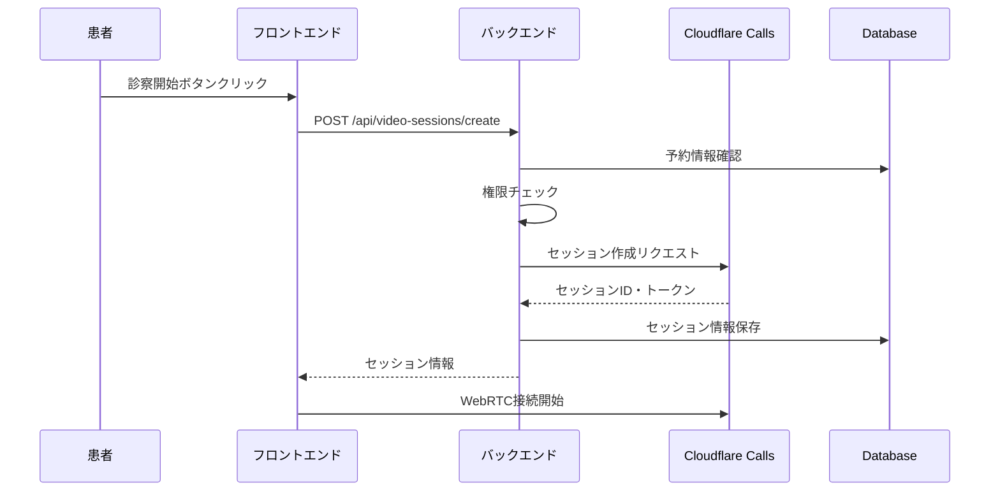

# 患者-医師ロール管理とセッション設計

## 概要

オンライン診療システムにおける患者と医師のロール管理、およびビデオ通話セッションの設計について定義します。

## 1. ロール定義と権限

### 1.1 ユーザーロール

```typescript
// types/user-roles.ts
export type UserType = 'patient' | 'worker';
export type WorkerRole = 'doctor' | 'operator' | 'admin';

export interface SessionParticipant {
  userType: UserType;
  userId: number;
  role?: WorkerRole; // workerの場合のみ
  displayName: string;
  permissions: SessionPermission[];
}

export interface SessionPermission {
  action: 'join' | 'leave' | 'mute' | 'unmute' | 'share_screen' | 'record' | 'end_session';
  allowed: boolean;
}
```

### 1.2 ロール別権限マトリックス

| アクション | 患者 | 医師 | オペレータ | 管理者 |
|-----------|------|------|-----------|--------|
| セッション参加 | ✓ | ✓ | ✓ | ✓ |
| セッション退出 | ✓ | ✓ | ✓ | ✓ |
| 音声ミュート | ✓ | ✓ | ✓ | ✓ |
| 画面共有 | ✓ | ✓ | ✓ | ✓ |
| セッション終了 | × | ✓ | ✓ | ✓ |
| 録画（将来） | × | △ | △ | ✓ |
| 他者をミュート | × | ✓ | ✓ | ✓ |

△: 患者の同意が必要

## 2. セッション管理設計

### 2.1 セッションライフサイクル

```typescript
// types/session-lifecycle.ts
export enum SessionStatus {
  SCHEDULED = 'scheduled',    // 予約済み
  WAITING = 'waiting',       // 待機中
  ACTIVE = 'active',         // 通話中
  ENDED = 'ended',          // 終了
  FAILED = 'failed'         // エラー
}

export interface VideoSession {
  id: string;
  appointmentId: string;
  realtimeSessionId: string;
  status: SessionStatus;
  participants: SessionParticipant[];
  startedAt?: Date;
  endedAt?: Date;
  metadata: SessionMetadata;
}

export interface SessionMetadata {
  scheduledDuration: number; // 分
  actualDuration?: number;   // 分
  endReason?: 'completed' | 'timeout' | 'error' | 'cancelled';
  quality?: SessionQuality;
}
```

### 2.2 セッション作成フロー



### 2.3 セッション参加制御

```typescript
// workers/realtime/session-manager.ts
export class SessionManager {
  constructor(
    private db: D1Database,
    private callsClient: CloudflareCallsClient
  ) {}

  async createSession(
    appointmentId: string,
    creatorUser: AuthUser
  ): Promise<VideoSession> {
    // 1. 予約の検証
    const appointment = await this.validateAppointment(appointmentId);
    
    // 2. 権限チェック
    await this.checkCreatePermission(appointment, creatorUser);
    
    // 3. Cloudflare Callsセッション作成
    const sessionId = this.generateSessionId();
    const cfSession = await this.callsClient.createSession(sessionId);
    
    // 4. データベースに保存
    const videoSession = await this.saveSession({
      appointmentId,
      realtimeSessionId: sessionId,
      status: SessionStatus.WAITING,
      createdBy: creatorUser
    });
    
    return videoSession;
  }

  async joinSession(
    sessionId: string,
    user: AuthUser
  ): Promise<JoinSessionResponse> {
    // 1. セッション情報取得
    const session = await this.getSession(sessionId);
    
    // 2. 参加権限チェック
    await this.checkJoinPermission(session, user);
    
    // 3. 参加者として追加
    await this.addParticipant(session, user);
    
    // 4. トラック作成
    const tracks = await this.createUserTracks(session, user);
    
    return {
      session,
      tracks,
      permissions: this.getUserPermissions(user)
    };
  }

  private async checkCreatePermission(
    appointment: Appointment,
    user: AuthUser
  ): Promise<void> {
    // 患者: 自分の予約のみ
    if (user.userType === 'patient') {
      if (appointment.patientId !== user.id) {
        throw new Error('Permission denied');
      }
    }
    // 医師: 担当予約のみ
    else if (user.role === 'doctor') {
      if (appointment.doctorId !== user.id) {
        throw new Error('Permission denied');
      }
    }
    // オペレータ・管理者: 全て可能
  }

  private async checkJoinPermission(
    session: VideoSession,
    user: AuthUser
  ): Promise<void> {
    const appointment = await this.getAppointment(session.appointmentId);
    
    // 患者: 自分の予約のみ
    if (user.userType === 'patient') {
      if (appointment.patientId !== user.id) {
        throw new Error('Permission denied');
      }
    }
    // 医師: 担当予約 + サポート参加
    else if (user.role === 'doctor') {
      const canJoin = 
        appointment.doctorId === user.id ||
        await this.isSuportDoctor(user.id, appointment.id);
      
      if (!canJoin) {
        throw new Error('Permission denied');
      }
    }
    // オペレータ・管理者: 全て参加可能
  }

  private getUserPermissions(user: AuthUser): SessionPermission[] {
    const permissions: SessionPermission[] = [
      { action: 'join', allowed: true },
      { action: 'leave', allowed: true },
      { action: 'mute', allowed: true },
      { action: 'unmute', allowed: true },
      { action: 'share_screen', allowed: true }
    ];

    // 医師以上はセッション終了権限
    if (user.userType === 'worker') {
      permissions.push({ action: 'end_session', allowed: true });
    }

    return permissions;
  }
}
```

## 3. トラック管理

### 3.1 トラック命名規則

```typescript
// workers/realtime/track-manager.ts
export class TrackManager {
  generateTrackName(
    user: AuthUser,
    trackType: 'audio' | 'video' | 'screen'
  ): string {
    // 形式: {userType}-{userId}-{trackType}-{timestamp}
    return `${user.userType}-${user.id}-${trackType}-${Date.now()}`;
  }

  async createUserTracks(
    session: VideoSession,
    user: AuthUser
  ): Promise<Track[]> {
    const tracks: Track[] = [];
    
    // 音声トラック（必須）
    tracks.push(await this.createTrack(
      session.realtimeSessionId,
      this.generateTrackName(user, 'audio'),
      'audio'
    ));
    
    // ビデオトラック（必須）
    tracks.push(await this.createTrack(
      session.realtimeSessionId,
      this.generateTrackName(user, 'video'),
      'video'
    ));
    
    return tracks;
  }
}
```

### 3.2 トラック権限管理

```typescript
export interface TrackPermissions {
  canPublish: boolean;
  canSubscribe: boolean;
  canControl: boolean; // ミュート等の制御
}

export function getTrackPermissions(
  trackOwner: AuthUser,
  viewer: AuthUser
): TrackPermissions {
  // 自分のトラックは全権限
  if (trackOwner.id === viewer.id && trackOwner.userType === viewer.userType) {
    return {
      canPublish: true,
      canSubscribe: true,
      canControl: true
    };
  }
  
  // 他者のトラック
  return {
    canPublish: false,
    canSubscribe: true,
    canControl: viewer.userType === 'worker' // 医療従事者のみ制御可能
  };
}
```

## 4. セッション品質管理

### 4.1 品質メトリクス

```typescript
export interface SessionQuality {
  // ネットワーク品質
  networkQuality: {
    latency: number;      // ms
    jitter: number;       // ms
    packetLoss: number;   // %
  };
  
  // メディア品質
  mediaQuality: {
    videoResolution: string;  // "1920x1080"
    videoFps: number;
    audioBitrate: number;     // kbps
  };
  
  // 接続安定性
  connectionStability: {
    reconnectCount: number;
    totalDisconnectTime: number; // 秒
  };
}
```

### 4.2 品質監視と対応

```typescript
// workers/realtime/quality-monitor.ts
export class QualityMonitor {
  async monitorSession(sessionId: string): Promise<void> {
    // 定期的に品質をチェック
    setInterval(async () => {
      const quality = await this.getSessionQuality(sessionId);
      
      // 品質低下時の対応
      if (quality.networkQuality.packetLoss > 5) {
        await this.notifyParticipants(sessionId, {
          type: 'quality_warning',
          message: 'ネットワーク品質が低下しています'
        });
      }
      
      // 自動調整
      if (quality.networkQuality.packetLoss > 10) {
        await this.adjustVideoQuality(sessionId, 'low');
      }
    }, 5000); // 5秒ごと
  }
}
```

## 5. データベーススキーマ

### 5.1 セッション参加者テーブル

```sql
-- 新規テーブル: session_participants
CREATE TABLE session_participants (
  id TEXT PRIMARY KEY,
  video_session_id TEXT NOT NULL,
  user_type TEXT NOT NULL, -- 'patient' | 'worker'
  user_id INTEGER NOT NULL,
  joined_at TEXT NOT NULL,
  left_at TEXT,
  role TEXT, -- 'doctor' | 'operator' | 'admin' (workerの場合のみ)
  is_active BOOLEAN DEFAULT TRUE,
  FOREIGN KEY (video_session_id) REFERENCES video_sessions(id)
);

-- インデックス
CREATE INDEX idx_session_participants_session ON session_participants(video_session_id);
CREATE INDEX idx_session_participants_user ON session_participants(user_type, user_id);
```

### 5.2 セッションイベントログ

```sql
-- 新規テーブル: session_events
CREATE TABLE session_events (
  id TEXT PRIMARY KEY,
  video_session_id TEXT NOT NULL,
  event_type TEXT NOT NULL, -- 'joined', 'left', 'muted', 'unmuted', etc.
  user_type TEXT NOT NULL,
  user_id INTEGER NOT NULL,
  metadata TEXT, -- JSON
  created_at TEXT NOT NULL,
  FOREIGN KEY (video_session_id) REFERENCES video_sessions(id)
);
```

## 6. セキュリティ考慮事項

### 6.1 セッションタイムアウト

```typescript
export const SESSION_CONFIG = {
  // 最大セッション時間（1時間）
  MAX_DURATION: 60 * 60 * 1000,
  
  // アイドルタイムアウト（15分）
  IDLE_TIMEOUT: 15 * 60 * 1000,
  
  // 参加待機タイムアウト（5分）
  JOIN_TIMEOUT: 5 * 60 * 1000
};
```

### 6.2 不正アクセス防止

```typescript
// セッションURL生成時に一時トークンを付与
export function generateSecureSessionUrl(
  sessionId: string,
  userId: number,
  userType: UserType
): string {
  const token = generateTemporaryToken({
    sessionId,
    userId,
    userType,
    expiresAt: Date.now() + 300000 // 5分
  });
  
  return `/consultation/${sessionId}?token=${token}`;
}
```

## 7. 実装優先順位

1. **Phase 1**: 基本的なロール管理とセッション作成
2. **Phase 2**: 参加制御と権限管理
3. **Phase 3**: 品質監視（簡易版）
4. **Phase 4**: セッションイベントログ
5. **Phase 5**: 高度な権限制御（録画等）

---
😊（ロール管理の設計が整理できた）
**エントロピー**: 🟦🟦🟦🟨🟨 (3/5)