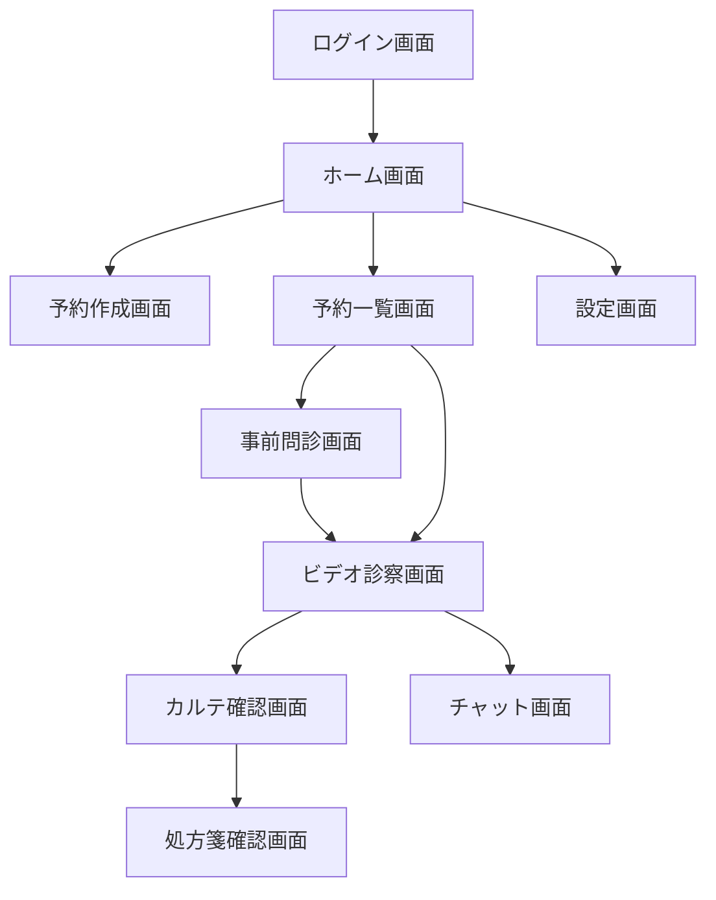

# 画面仕様書

## 概要

本書は、オンライン診療システムのReactフロントエンド画面仕様を詳細に定義します。各画面の表示要素、操作、状態管理、API連携について記載しています。

## 画面遷移図



## 1. ログイン画面（S-01）

### 画面レイアウト

```
┌─────────────────────────────────────┐
│          [ロゴ]                     │
│      オンライン診療システム          │
│                                     │
│  ┌─────────────────────────────┐  │
│  │ メールアドレス               │  │
│  └─────────────────────────────┘  │
│                                     │
│  ┌─────────────────────────────┐  │
│  │ パスワード                   │  │
│  └─────────────────────────────┘  │
│                                     │
│  ○ 患者として  ○ 医師として        │
│                                     │
│  ┌─────────────────────────────┐  │
│  │       ログイン                │  │
│  └─────────────────────────────┘  │
│                                     │
│  パスワードを忘れた方 | 新規登録    │
└─────────────────────────────────────┘
```

### 状態管理

```typescript
interface LoginState {
  email: string;
  password: string;
  userType: 'patient' | 'doctor';
  isLoading: boolean;
  error: string | null;
}
```

### バリデーション

- メールアドレス: 必須、メール形式
- パスワード: 必須、8文字以上
- ユーザータイプ: 必須選択

### API連携詳細

```typescript
// リクエスト
POST /api/auth/login
{
  "email": "user@example.com",
  "password": "password123",
  "userType": "patient"
}

// レスポンス
{
  "token": "jwt-token",
  "refreshToken": "refresh-token",
  "user": {
    "id": "user-id",
    "name": "山田太郎",
    "type": "patient"
  }
}
```

## 2. ホーム画面（S-02）

### 患者用レイアウト

```
┌─────────────────────────────────────┐
│  [≡] オンライン診療  [🔔] [👤]     │
├─────────────────────────────────────┤
│                                     │
│  こんにちは、山田太郎さん           │
│                                     │
│  ▼ 本日の予約                      │
│  ┌─────────────────────────────┐  │
│  │ 14:00 - 内科 田中医師        │  │
│  │ [チェックイン]               │  │
│  └─────────────────────────────┘  │
│                                     │
│  ┌─────────────────────────────┐  │
│  │    新規予約を作成             │  │
│  └─────────────────────────────┘  │
│                                     │
│  ┌─────────────────────────────┐  │
│  │    予約一覧を見る             │  │
│  └─────────────────────────────┘  │
│                                     │
│  ┌─────────────────────────────┐  │
│  │    過去の診察履歴             │  │
│  └─────────────────────────────┘  │
└─────────────────────────────────────┘
```

### 医師用レイアウト

```
┌─────────────────────────────────────┐
│  [≡] オンライン診療  [🔔] [👤]     │
├─────────────────────────────────────┤
│                                     │
│  本日の診察予定                     │
│                                     │
│  待機中: 2名                        │
│                                     │
│  ▼ 診察予定                        │
│  ┌─────────────────────────────┐  │
│  │ 14:00 山田太郎 (内科)        │  │
│  │ [診察開始] [問診確認]        │  │
│  └─────────────────────────────┘  │
│  ┌─────────────────────────────┐  │
│  │ 14:30 鈴木花子 (内科)        │  │
│  │ [診察準備]                   │  │
│  └─────────────────────────────┘  │
│                                     │
│  本日の診察数: 5件                  │
│  平均診察時間: 12分                 │
└─────────────────────────────────────┘
```

### 状態管理

```typescript
interface HomeState {
  userInfo: {
    id: string;
    name: string;
    type: 'patient' | 'doctor';
  };
  todayAppointments: Appointment[];
  notifications: Notification[];
  statistics?: {
    todayCount: number;
    averageTime: number;
  };
}
```

## 3. 予約作成画面（S-03）

### 画面レイアウト

```
┌─────────────────────────────────────┐
│  [←] 新規予約作成                   │
├─────────────────────────────────────┤
│                                     │
│  ▼ 日付を選択                      │
│  ┌─────────────────────────────┐  │
│  │     2025年1月                │  │
│  │ 日 月 火 水 木 金 土         │  │
│  │        1  2  3  4  5         │  │
│  │  6  7  8  9 10 11 12         │  │
│  │ 13 14 15 16 17 18 19         │  │
│  │ 20 21 22 23 24 25 26         │  │
│  │ 27 [28] 29 30 31             │  │
│  └─────────────────────────────┘  │
│                                     │
│  ▼ 時間帯を選択                    │
│  [10:00] [10:30] [11:00] [11:30]   │
│  [14:00] [14:30] [15:00] [15:30]   │
│                                     │
│  ▼ 症状カテゴリ                    │
│  [内科] [皮膚科] [耳鼻科] [その他] │
│                                     │
│  ▼ 症状の説明                      │
│  ┌─────────────────────────────┐  │
│  │ 3日前から咳が続いています... │  │
│  └─────────────────────────────┘  │
│                                     │
│  ┌─────────────────────────────┐  │
│  │       予約を確定               │  │
│  └─────────────────────────────┘  │
└─────────────────────────────────────┘
```

### 状態管理

```typescript
interface AppointmentCreateState {
  selectedDate: Date | null;
  selectedTime: string | null;
  category: string | null;
  description: string;
  availableSlots: TimeSlot[];
  isLoading: boolean;
}
```

## 4. ビデオ診察画面（S-06）

### 画面レイアウト

```
┌─────────────────────────────────────┐
│  診察中 - 田中医師                  │
├─────────────────────────────────────┤
│  ┌─────────────────┬─────────────┐ │
│  │                 │             │ │
│  │   相手の映像    │  自分の映像  │ │
│  │                 │             │ │
│  │                 │             │ │
│  └─────────────────┴─────────────┘ │
│                                     │
│  [🎤] [📹] [💬] [📱] [📞]         │
│   ミュート カメラ チャット 共有 終了 │
│                                     │
│  ▼ リアルタイム文字起こし          │
│  ┌─────────────────────────────┐  │
│  │ 医師: 今日はどうされました？ │  │
│  │ 患者: 3日前から咳が...       │  │
│  │ 医師: 熱はありますか？       │  │
│  └─────────────────────────────┘  │
│                                     │
│  💡 重要: アレルギー歴あり          │
└─────────────────────────────────────┘
```

### 状態管理

```typescript
interface VideoCallState {
  meetingId: string;
  localStream: MediaStream | null;
  remoteStream: MediaStream | null;
  isMuted: boolean;
  isVideoOff: boolean;
  transcription: TranscriptLine[];
  highlights: string[];
  connectionStatus: 'connecting' | 'connected' | 'disconnected';
}
```

### WebSocket通信

```typescript
// 文字起こしWebSocket
ws.send({
  type: 'audio_chunk',
  data: audioData,
  timestamp: Date.now(),
});

ws.onmessage = (event) => {
  const data = JSON.parse(event.data);
  if (data.type === 'transcription') {
    updateTranscription(data.text, data.speaker);
  }
  if (data.type === 'highlight') {
    addHighlight(data.keyword);
  }
};
```

## 5. 事前問診画面（S-05）

### 画面レイアウト

```
┌─────────────────────────────────────┐
│  [←] 事前問診                       │
├─────────────────────────────────────┤
│  進捗: ●●●○○ (3/5)                  │
│                                     │
│  ▼ 質問3                           │
│  ┌─────────────────────────────┐  │
│  │ 咳はいつから続いていますか？ │  │
│  └─────────────────────────────┘  │
│                                     │
│  ○ 1日以内                         │
│  ○ 2-3日                           │
│  ● 4-7日                           │
│  ○ 1週間以上                       │
│                                     │
│  または音声で回答:                  │
│  ┌─────────────────────────────┐  │
│  │      [🎤] 録音開始            │  │
│  └─────────────────────────────┘  │
│                                     │
│  [前の質問] [次の質問]              │
│                                     │
│  💡 AIアシスタント: 症状の経過を    │
│     詳しく教えていただけますか？    │
└─────────────────────────────────────┘
```

### 動的質問生成

```typescript
interface QuestionnaireState {
  currentQuestion: number;
  totalQuestions: number;
  questions: Question[];
  answers: Answer[];
  isRecording: boolean;
  aiSuggestions: string[];
}

// AIによる次の質問生成
const generateNextQuestion = async (answers: Answer[]) => {
  const response = await fetch('/api/questionnaire/next-question', {
    method: 'POST',
    body: JSON.stringify({ answers }),
  });
  return response.json();
};
```

## 6. 共通UIコンポーネント

### ヘッダーコンポーネント

```typescript
interface HeaderProps {
  title: string;
  showBack?: boolean;
  showNotifications?: boolean;
  notificationCount?: number;
}

const Header: React.FC<HeaderProps> = ({
  title,
  showBack,
  showNotifications,
  notificationCount
}) => {
  return (
    <header className="app-header">
      {showBack && <BackButton />}
      <h1>{title}</h1>
      {showNotifications && (
        <NotificationBadge count={notificationCount} />
      )}
    </header>
  );
};
```

### エラー処理

```typescript
const ErrorBoundary: React.FC = ({ children }) => {
  return (
    <ErrorBoundaryComponent
      fallback={<ErrorFallback />}
      onError={(error, errorInfo) => {
        console.error('Error caught:', error, errorInfo);
        // エラーログ送信
      }}
    >
      {children}
    </ErrorBoundaryComponent>
  );
};
```

## 7. レスポンシブ対応

### ブレークポイント

- Mobile: < 768px
- Tablet: 768px - 1024px
- Desktop: > 1024px

### モバイル最適化

```css
/* ビデオ診察画面のモバイル対応 */
@media (max-width: 768px) {
  .video-container {
    flex-direction: column;
  }

  .remote-video {
    width: 100%;
    height: 50vh;
  }

  .local-video {
    position: absolute;
    width: 30%;
    bottom: 20px;
    right: 20px;
  }
}
```

## 8. アクセシビリティ

### キーボードナビゲーション

- Tab: 次の要素へ
- Shift+Tab: 前の要素へ
- Enter/Space: ボタン押下
- Esc: モーダル閉じる

### ARIA対応

```jsx
<button aria-label="音声をミュート" aria-pressed={isMuted} onClick={toggleMute}>
  <MuteIcon />
</button>
```

## まとめ

本画面仕様書は、開発者が実装時に参照すべき詳細な仕様を提供しています。各画面は独立して開発可能であり、共通コンポーネントを活用することで効率的な開発が可能です。
