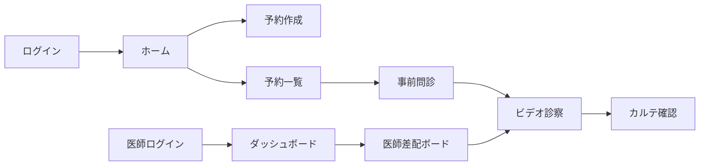

# UI/UX仕様書 - オンライン診療システム

## 概要

本書は、オンライン診療システムのUI/UX設計指針と具体的な実装仕様を定義します。ハッカソン参加者が機能を拡張する際の基盤となるデザインシステムとインタラクション原則を提供します。

## デバイス別設計方針

### 患者向け画面（User）- スマートフォン優先設計

- **想定デバイス**: スマートフォン（iOS/Android）
- **画面サイズ**: 375px〜428px（iPhone/Android標準サイズ）
- **操作方法**: タッチ操作中心
- **UI設計**: 親指での操作を考慮した下部ナビゲーション

### 医療従事者向け画面（Worker）- PC優先設計

- **想定デバイス**: デスクトップPC/ノートPC
- **画面サイズ**: 1280px以上
- **操作方法**: マウス・キーボード操作
- **UI設計**: 情報密度の高いダッシュボード型レイアウト

## デザイン原則

### 1. アクセシビリティファースト

- **WCAG 2.1 AA準拠**: 基本的なアクセシビリティ要件に対応
- **高コントラストモード対応**: 視認性の確保
- **スクリーンリーダー対応**: ARIA属性の適切な実装
- **多言語対応**: i18nextによる国際化

### 2. デバイス特化型デザイン

#### 患者向け（スマートフォン）

```scss
// スマートフォン向けブレークポイント
$user-breakpoints: (
  small: 375px,
  // iPhone SE等
  medium: 390px,
  // iPhone 14等
  large: 428px, // iPhone 14 Plus等
);
```

#### 医療従事者向け（PC）

```scss
// PC向けブレークポイント
$worker-breakpoints: (
  laptop: 1280px,
  // ノートPC
  desktop: 1440px,
  // デスクトップ
  wide: 1920px, // フルHD以上
);
```

### 3. パフォーマンス最適化

- **遅延読み込み**: React.lazyによるコード分割
- **画像最適化**: WebP形式の優先使用
- **アニメーション制御**: prefers-reduced-motionの尊重

## カラースキーム

### ベースカラー

```css
:root {
  /* Primary Colors */
  --primary-50: #e3f2fd;
  --primary-100: #bbdefb;
  --primary-200: #90caf9;
  --primary-300: #64b5f6;
  --primary-400: #42a5f5;
  --primary-500: #2196f3; /* Main Primary */
  --primary-600: #1e88e5;
  --primary-700: #1976d2;
  --primary-800: #1565c0;
  --primary-900: #0d47a1;

  /* Neutral Colors */
  --gray-50: #fafafa;
  --gray-100: #f5f5f5;
  --gray-200: #eeeeee;
  --gray-300: #e0e0e0;
  --gray-400: #bdbdbd;
  --gray-500: #9e9e9e;
  --gray-600: #757575;
  --gray-700: #616161;
  --gray-800: #424242;
  --gray-900: #212121;

  /* Status Colors */
  --success: #4caf50;
  --warning: #ff9800;
  --error: #f44336;
  --info: #03a9f4;
}
```

### ダークモード対応

```css
[data-theme='dark'] {
  --bg-primary: #121212;
  --bg-secondary: #1e1e1e;
  --text-primary: #ffffff;
  --text-secondary: #aaaaaa;
}
```

## タイポグラフィ

### フォントファミリー

```css
:root {
  --font-primary: -apple-system, BlinkMacSystemFont, 'Segoe UI', 'Noto Sans JP', sans-serif;
  --font-mono: 'SF Mono', Monaco, 'Cascadia Code', monospace;
}
```

### フォントスケール

```scss
$font-sizes: (
  xs: 0.75rem,
  // 12px
  sm: 0.875rem,
  // 14px
  base: 1rem,
  // 16px
  lg: 1.125rem,
  // 18px
  xl: 1.25rem,
  // 20px
  2xl: 1.5rem,
  // 24px
  3xl: 1.875rem,
  // 30px
  4xl: 2.25rem, // 36px
);
```

## グリッドシステム

### 12カラムグリッド

```scss
.container {
  width: 100%;
  max-width: 1200px;
  margin: 0 auto;
  padding: 0 1rem;

  @media (min-width: 768px) {
    padding: 0 2rem;
  }
}

.grid {
  display: grid;
  grid-template-columns: repeat(12, 1fr);
  gap: 1.5rem;
}
```

## コンポーネントライブラリ

### shadcn/ui採用理由

1. **コピー&ペースト方式**: ライブラリ依存を最小化
2. **Tailwind CSS基盤**: 一貫したスタイリング
3. **Radix UI統合**: アクセシビリティ標準対応
4. **TypeScript完全対応**: 型安全性の確保

### 基本コンポーネント

```typescript
// Button Component Example
interface ButtonProps {
  variant?: 'primary' | 'secondary' | 'ghost' | 'danger';
  size?: 'sm' | 'md' | 'lg';
  loading?: boolean;
  disabled?: boolean;
  fullWidth?: boolean;
}
```

## 画面設計

### 画面遷移図



### レイアウトパターン

#### 1. スマートフォンレイアウト（患者向け）

```jsx
<MobileLayout>
  <MobileHeader>
    <BackButton />
    <Title />
    <MenuButton />
  </MobileHeader>
  <ScrollableContent>
    <Container maxWidth="100%">{/* Page Content */}</Container>
  </ScrollableContent>
  <BottomNavigation>
    <NavItem icon="home" />
    <NavItem icon="calendar" />
    <NavItem icon="message" />
    <NavItem icon="settings" />
  </BottomNavigation>
</MobileLayout>
```

**特徴:**

- 固定ヘッダー・フッター
- 下部ナビゲーション（親指での操作考慮）
- フルスクリーン幅のコンテンツ
- 大きめのタッチターゲット（最小44px）

#### 2. PCダッシュボードレイアウト（医療従事者向け）

```jsx
<DesktopLayout>
  <Sidebar width="240px">
    <Logo />
    <Navigation />
    <UserProfile />
  </Sidebar>
  <Main>
    <TopBar height="64px">
      <Breadcrumb />
      <Actions />
      <Notifications />
    </TopBar>
    <Content padding="24px">
      <Grid container spacing={3}>
        {/* Dashboard Content */}
      </Grid>
    </Content>
  </Main>
</DesktopLayout>
```

**特徴:**

- 固定サイドバー（240px幅）
- 情報密度の高いグリッドレイアウト
- 複数パネルの同時表示
- ドラッグ&ドロップ対応（医師差配ボード等）

#### 3. フルスクリーンレイアウト（ビデオ通話）

```jsx
<FullscreenLayout>
  <VideoContainer>
    <RemoteVideo />
    <LocalVideo />
  </VideoContainer>
  <ControlBar />
  <ChatPanel />
</FullscreenLayout>
```

## インタラクションデザイン

### アニメーション原則

```css
/* グローバルトランジション設定 */
:root {
  --transition-fast: 150ms ease-in-out;
  --transition-base: 250ms ease-in-out;
  --transition-slow: 350ms ease-in-out;
}

/* マイクロインタラクション */
.button {
  transition: all var(--transition-fast);

  &:hover {
    transform: translateY(-1px);
    box-shadow: 0 4px 12px rgba(0, 0, 0, 0.15);
  }

  &:active {
    transform: translateY(0);
  }
}
```

### ローディング状態

```typescript
// スケルトンローディング
const SkeletonLoader = () => (
  <div className="animate-pulse">
    <div className="h-4 bg-gray-200 rounded w-3/4 mb-2"></div>
    <div className="h-4 bg-gray-200 rounded w-1/2"></div>
  </div>
);

// プログレスインジケーター
const ProgressBar = ({ value }: { value: number }) => (
  <div className="w-full bg-gray-200 rounded-full h-2">
    <div
      className="bg-primary-500 h-2 rounded-full transition-all"
      style={{ width: `${value}%` }}
    />
  </div>
);
```

### エラーハンドリング

```typescript
// エラー表示コンポーネント
const ErrorMessage = ({ error, retry }: ErrorProps) => (
  <Alert variant="error">
    <AlertIcon />
    <AlertTitle>エラーが発生しました</AlertTitle>
    <AlertDescription>{error.message}</AlertDescription>
    {retry && (
      <Button onClick={retry} variant="ghost" size="sm">
        再試行
      </Button>
    )}
  </Alert>
);
```

## フォームデザイン

### 入力フィールド

```jsx
<FormField>
  <Label htmlFor="email">メールアドレス</Label>
  <Input
    id="email"
    type="email"
    placeholder="example@mail.com"
    error={errors.email}
    aria-describedby="email-error"
  />
  {errors.email && <ErrorMessage id="email-error">{errors.email}</ErrorMessage>}
</FormField>
```

### バリデーション

- **リアルタイムバリデーション**: onBlur時に実行
- **エラーメッセージ**: 具体的で行動可能な内容
- **成功フィードバック**: 正しい入力の視覚的確認

## デバイス別UX設計

### 患者向け - スマートフォンUX

#### タッチ最適化

```css
/* 患者向けタッチターゲットサイズ */
.user-touch-target {
  min-width: 48px; /* より大きめに設定 */
  min-height: 48px;
}

/* スワイプ対応 */
.user-swipeable {
  touch-action: pan-y;
}
```

#### スマートフォン特有の考慮事項

1. **下部ナビゲーション**: 片手操作を前提とした設計
2. **プルトゥリフレッシュ**: 予約一覧等での更新操作
3. **モーダル表示**: フルスクリーン表示で集中しやすく
4. **文字サイズ**: 最小16px（ズーム防止）
5. **縦向き固定**: 診察中の画面回転防止

### 医療従事者向け - PC UX

#### マウス・キーボード最適化

```css
/* Worker向けインタラクティブ要素 */
.worker-clickable {
  cursor: pointer;
  transition: all 0.2s;
}

.worker-clickable:hover {
  background-color: rgba(0, 0, 0, 0.05);
}

/* ドラッグ&ドロップ対応 */
.worker-draggable {
  cursor: grab;
}

.worker-draggable:active {
  cursor: grabbing;
}
```

#### PC特有の考慮事項

1. **マルチウィンドウ対応**: 複数画面での作業を想定
2. **右クリックメニュー**: コンテキストメニューの活用
3. **ショートカットキー**: 効率的な操作（Ctrl+S等）
4. **高密度情報表示**: 1画面での情報量最大化
5. **ツールチップ**: ホバー時の詳細情報表示

## アクセシビリティ

### ARIA実装

```jsx
// アクセシブルなモーダル
<Dialog
  role="dialog"
  aria-modal="true"
  aria-labelledby="dialog-title"
  aria-describedby="dialog-description"
>
  <DialogTitle id="dialog-title">予約確認</DialogTitle>
  <DialogContent id="dialog-description">{/* Content */}</DialogContent>
</Dialog>
```

## パフォーマンス指標

### Core Web Vitals目標値

- **LCP (Largest Contentful Paint)**: < 2.5秒
- **FID (First Input Delay)**: < 100ms
- **CLS (Cumulative Layout Shift)**: < 0.1

### 最適化戦略

1. **画像最適化**

   ```jsx
   <Image src="/image.webp" alt="Description" loading="lazy" decoding="async" />
   ```

2. **コード分割**

   ```typescript
   const VideoCall = lazy(() => import('./VideoCall'));
   ```

3. **メモ化**
   ```typescript
   const MemoizedComponent = memo(Component, (prev, next) => {
     return prev.id === next.id;
   });
   ```

## 拡張ガイドライン

### ハッカソン参加者向け

1. **カスタムテーマ作成**

   ```typescript
   const customTheme = {
     colors: {
       primary: '#custom-color',
       // Additional colors
     },
     // Theme configuration
   };
   ```

2. **新規コンポーネント追加**
   - shadcn/uiの規約に従う
   - ストーリーブック対応
   - アクセシビリティテスト必須

3. **AI機能統合UI**
   ```jsx
   // AI機能追加例
   <AIAssistantPanel>
     <TranscriptionDisplay />
     <SuggestionList />
     <ConfidenceIndicator />
   </AIAssistantPanel>
   ```

## デザイントークン

### 間隔システム

```scss
$spacing: (
  0: 0,
  1: 0.25rem,
  // 4px
  2: 0.5rem,
  // 8px
  3: 0.75rem,
  // 12px
  4: 1rem,
  // 16px
  5: 1.25rem,
  // 20px
  6: 1.5rem,
  // 24px
  8: 2rem,
  // 32px
  10: 2.5rem,
  // 40px
  12: 3rem,
  // 48px
  16: 4rem, // 64px
);
```

### 影システム

```css
:root {
  --shadow-sm: 0 1px 2px rgba(0, 0, 0, 0.05);
  --shadow-md: 0 4px 6px rgba(0, 0, 0, 0.1);
  --shadow-lg: 0 10px 15px rgba(0, 0, 0, 0.1);
  --shadow-xl: 0 20px 25px rgba(0, 0, 0, 0.1);
}
```

## まとめ

本UI/UX仕様書は、オンライン診療システムの一貫したユーザー体験を提供するための包括的なガイドラインです。ハッカソン参加者は、これらの原則に従いながら、創造的な機能拡張を行うことができます。

### 重要なポイント

1. **アクセシビリティ**: すべてのユーザーが利用可能
2. **拡張性**: 新機能追加が容易
3. **パフォーマンス**: 高速で応答性の高いUI
4. **一貫性**: 統一されたデザイン言語

### 次のステップ

- コンポーネントカタログの参照
- デザイントークンのカスタマイズ
- AI機能UIの実装
