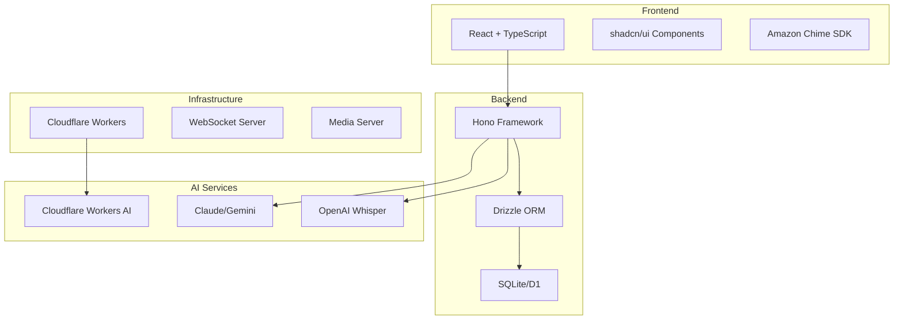

# 技術仕様書 - オンライン診療システム

## 概要

本書は、ハッカソン向けオンライン診療システムの技術仕様を定義します。特にDrizzle ORMを中心としたデータベース設計、Cloudflare Workers対応のアーキテクチャ、およびAI機能の統合について詳述します。

## 1. システムアーキテクチャ

### 1.1 全体構成



### 1.2 技術スタック

#### フロントエンド

- **Framework**: React 18+ with TypeScript
- **UI Library**: shadcn/ui (Tailwind CSS + Radix UI)
- **State Management**: React Context API + useReducer
- **Routing**: React Router v6
- **Video SDK**: Amazon Chime SDK
- **Build Tool**: Vite

#### バックエンド

- **Framework**: Hono (Cloudflare Workers対応)
- **ORM**: Drizzle ORM
- **Database**:
  - 開発: SQLite (better-sqlite3)
  - 本番: Cloudflare D1
- **Authentication**: JWT
- **API Style**: RESTful + WebSocket

#### インフラストラクチャ

- **Runtime**: Cloudflare Workers (Edge Computing)
- **CDN**: Cloudflare
- **Storage**: Cloudflare R2 (オブジェクトストレージ)
- **Real-time**: WebSocket (Cloudflare Durable Objects)

## 2. データベース設計（Drizzle ORM）

### 2.1 Drizzle ORM選定理由

1. **軽量性**: Prismaと比較して大幅に小さいバンドルサイズ
2. **エッジ対応**: Cloudflare Workersで完全動作
3. **型安全性**: TypeScript完全対応
4. **柔軟性**: SQLライクな記法で学習曲線が緩やか
5. **パフォーマンス**: ランタイムオーバーヘッドが最小

### 2.2 スキーマ定義例

```typescript
// src/db/schema.ts
import { sqliteTable, text, integer, real } from 'drizzle-orm/sqlite-core';

// ユーザーテーブル（患者・医療従事者統合）
export const users = sqliteTable('users', {
  id: integer('id').primaryKey({ autoIncrement: true }),
  email: text('email').notNull().unique(),
  name: text('name').notNull(),
  role: text('role', { enum: ['patient', 'doctor', 'operator', 'admin'] }).notNull(),
  passwordHash: text('password_hash').notNull(),
  createdAt: integer('created_at', { mode: 'timestamp' }).notNull().defaultNow(),
  updatedAt: integer('updated_at', { mode: 'timestamp' }).notNull().defaultNow(),
});

// 予約テーブル
export const appointments = sqliteTable('appointments', {
  id: integer('id').primaryKey({ autoIncrement: true }),
  patientId: integer('patient_id')
    .notNull()
    .references(() => users.id),
  doctorId: integer('doctor_id').references(() => users.id),
  scheduledAt: integer('scheduled_at', { mode: 'timestamp' }).notNull(),
  status: text('status', {
    enum: ['scheduled', 'waiting', 'in_progress', 'completed', 'cancelled'],
  })
    .notNull()
    .default('scheduled'),
  chiefComplaint: text('chief_complaint'),
  createdAt: integer('created_at', { mode: 'timestamp' }).notNull().defaultNow(),
});

// 診察記録テーブル（SOAP形式）
export const medicalRecords = sqliteTable('medical_records', {
  id: integer('id').primaryKey({ autoIncrement: true }),
  appointmentId: integer('appointment_id')
    .notNull()
    .references(() => appointments.id),
  subjective: text('subjective'), // S: 主観的所見
  objective: text('objective'), // O: 客観的所見
  assessment: text('assessment'), // A: 評価
  plan: text('plan'), // P: 計画
  aiSummary: text('ai_summary', { mode: 'json' }), // AI解析結果
  createdAt: integer('created_at', { mode: 'timestamp' }).notNull().defaultNow(),
});
```

### 2.3 JSON型フィールドの型定義（Zod採用）

**重要**: 本セクションは設計段階のドキュメントです。実際のコード実装は、React-Router-Hono フルスタックテンプレートベース開発環境構築後に行います。

#### 技術選定：Zodを採用

JSON型フィールドの型定義・バリデーションにはZodを採用します。

**選定理由**:

- TypeScript型推論が自動的に働き、別途型定義が不要
- Drizzle ORMと同じTypeScriptエコシステムで親和性が高い
- ランタイム検証とコンパイル時の型チェックが一致
- 学習曲線が緩やか（TypeScript的な記法）
- バンドルサイズが小さい（約12KB）

**実装方針**:

- すべてのJSON型フィールドにZodスキーマを定義
- Drizzle ORMのカスタムタイプとして統合
- 詳細な実装ガイドは `docs/api/database-design-json-types.md` を参照

### 2.4 マイグレーション戦略

```typescript
// drizzle.config.ts
import type { Config } from 'drizzle-kit';

export default {
  schema: './src/db/schema.ts',
  out: './drizzle',
  driver: 'better-sqlite',
  dbCredentials: {
    url: process.env.DATABASE_URL || './local.db',
  },
} satisfies Config;
```

## 3. API設計

### 3.1 Hono実装例

```typescript
// src/api/index.ts
import { Hono } from 'hono';
import { drizzle } from 'drizzle-orm/better-sqlite3';
import { users, appointments } from './db/schema';

const app = new Hono();
const db = drizzle(/* ... */);

// 患者向けAPI
app.get('/api/user/appointments', async (c) => {
  const userId = c.get('userId'); // JWT from middleware
  const results = await db.select().from(appointments).where(eq(appointments.patientId, userId));

  return c.json(results);
});

// 医療従事者向けAPI
app.get('/api/worker/appointments/pending', async (c) => {
  const results = await db
    .select()
    .from(appointments)
    .where(eq(appointments.status, 'waiting'))
    .orderBy(appointments.scheduledAt);

  return c.json(results);
});
```

### 3.2 WebSocket実装

```typescript
// リアルタイム通信（Cloudflare Durable Objects使用）
export class MeetingRoom {
  private state: DurableObjectState;
  private sessions: Map<string, WebSocket> = new Map();

  constructor(state: DurableObjectState) {
    this.state = state;
  }

  async fetch(request: Request) {
    const upgradeHeader = request.headers.get('Upgrade');
    if (upgradeHeader !== 'websocket') {
      return new Response('Expected websocket', { status: 400 });
    }

    const [client, server] = Object.values(new WebSocketPair());
    await this.handleSession(server, request);

    return new Response(null, {
      status: 101,
      webSocket: client,
    });
  }

  async handleSession(websocket: WebSocket, request: Request) {
    // WebSocket session handling
  }
}
```

## 4. AI機能統合

### 4.1 音声書き起こしサービス

```typescript
// src/services/transcription.ts
interface TranscriptionProvider {
  transcribe(audio: ArrayBuffer): Promise<string>;
}

class TranscriptionService {
  private providers: Map<string, TranscriptionProvider>;

  constructor() {
    this.providers = new Map([
      ['openai', new OpenAIWhisperProvider()],
      ['cloudflare', new CloudflareAIProvider()],
      ['gemini', new GeminiProvider()],
    ]);
  }

  async transcribe(audio: ArrayBuffer, provider = 'openai'): Promise<string> {
    const service = this.providers.get(provider);
    if (!service) throw new Error(`Provider ${provider} not found`);

    return service.transcribe(audio);
  }
}

// OpenAI Whisper実装
class OpenAIWhisperProvider implements TranscriptionProvider {
  async transcribe(audio: ArrayBuffer): Promise<string> {
    const formData = new FormData();
    formData.append('file', new Blob([audio], { type: 'audio/webm' }));
    formData.append('model', 'whisper-1');

    const response = await fetch('https://api.openai.com/v1/audio/transcriptions', {
      method: 'POST',
      headers: {
        Authorization: `Bearer ${process.env.OPENAI_API_KEY}`,
      },
      body: formData,
    });

    const result = await response.json();
    return result.text;
  }
}
```

### 4.2 医療情報抽出

```typescript
// src/services/medical-ai.ts
class MedicalAIService {
  async extractMedicalInfo(transcript: string) {
    // Claude APIを使用した医療情報抽出
    const response = await fetch('https://api.anthropic.com/v1/messages', {
      method: 'POST',
      headers: {
        'x-api-key': process.env.ANTHROPIC_API_KEY,
        'anthropic-version': '2023-06-01',
        'content-type': 'application/json',
      },
      body: JSON.stringify({
        model: 'claude-3-opus-20240229',
        max_tokens: 1024,
        messages: [
          {
            role: 'user',
            content: `以下の診察会話から医療情報を抽出し、SOAP形式で整理してください：\n${transcript}`,
          },
        ],
      }),
    });

    return response.json();
  }
}
```

## 5. セキュリティ仕様

### 5.1 認証・認可

```typescript
// JWT実装
import { sign, verify } from 'hono/jwt';

const generateToken = (userId: number, role: string) => {
  return sign(
    {
      sub: userId.toString(),
      role,
      iat: Math.floor(Date.now() / 1000),
      exp: Math.floor(Date.now() / 1000) + 60 * 60 * 24, // 24 hours
    },
    process.env.JWT_SECRET
  );
};

// ミドルウェア
const authMiddleware = async (c: Context, next: Next) => {
  const token = c.req.header('Authorization')?.replace('Bearer ', '');
  if (!token) return c.json({ error: 'Unauthorized' }, 401);

  try {
    const payload = await verify(token, process.env.JWT_SECRET);
    c.set('userId', payload.sub);
    c.set('userRole', payload.role);
    await next();
  } catch {
    return c.json({ error: 'Invalid token' }, 401);
  }
};
```

### 5.2 データ保護

- **暗号化**: 患者の個人情報は保存時に暗号化
- **HTTPS**: 全通信をTLS暗号化
- **CORS**: 適切なオリジン制限
- **Rate Limiting**: APIアクセス制限

## 6. 開発環境構築

### 6.1 必要なツール

```bash
# Node.js環境
node >= 18.0.0
npm >= 9.0.0

# Cloudflare開発ツール
npm install -g wrangler

# プロジェクト依存関係
npm install hono drizzle-orm drizzle-kit better-sqlite3
npm install -D @types/better-sqlite3 @cloudflare/workers-types
```

### 6.2 環境変数設定

```env
# .env.local
DATABASE_URL=./local.db
JWT_SECRET=your-secret-key
OPENAI_API_KEY=your-openai-key
ANTHROPIC_API_KEY=your-claude-key
GEMINI_API_KEY=your-gemini-key
```

### 6.3 ローカル開発コマンド

```bash
# データベースマイグレーション
npm run db:push

# 開発サーバー起動
npm run dev

# Cloudflare Workers ローカル実行
wrangler dev
```

## 7. デプロイメント

### 7.1 Cloudflare Workers設定

```toml
# wrangler.toml
name = "medical-consultation"
main = "src/index.ts"
compatibility_date = "2024-01-01"

[[d1_databases]]
binding = "DB"
database_name = "medical-db"
database_id = "your-database-id"

[vars]
ENVIRONMENT = "production"

[[durable_objects.bindings]]
name = "MEETING_ROOM"
class_name = "MeetingRoom"
```

### 7.2 CI/CD設定

```yaml
# .github/workflows/deploy.yml
name: Deploy to Cloudflare Workers
on:
  push:
    branches: [main]

jobs:
  deploy:
    runs-on: ubuntu-latest
    steps:
      - uses: actions/checkout@v3
      - uses: actions/setup-node@v3
      - run: npm ci
      - run: npm run build
      - uses: cloudflare/wrangler-action@v3
        with:
          apiToken: ${{ secrets.CLOUDFLARE_API_TOKEN }}
```

## 8. パフォーマンス最適化

### 8.1 データベースクエリ最適化

```typescript
// バッチクエリの活用
const appointmentsWithRecords = await db
  .select({
    appointment: appointments,
    record: medicalRecords,
  })
  .from(appointments)
  .leftJoin(medicalRecords, eq(appointments.id, medicalRecords.appointmentId))
  .where(eq(appointments.patientId, userId));
```

### 8.2 キャッシュ戦略

```typescript
// Cloudflare KVを使用したキャッシュ
const cachedData = await c.env.KV.get(`user:${userId}:appointments`);
if (cachedData) return c.json(JSON.parse(cachedData));

// データ取得後にキャッシュ
await c.env.KV.put(
  `user:${userId}:appointments`,
  JSON.stringify(data),
  { expirationTtl: 300 } // 5分間キャッシュ
);
```

## 9. 監視・ログ

### 9.1 エラートラッキング

```typescript
// グローバルエラーハンドラー
app.onError((err, c) => {
  console.error(`Error in ${c.req.path}:`, err);

  // エラーをCloudflare Analytics に送信
  c.env.ANALYTICS.writeDataPoint({
    blobs: ['error', c.req.path, err.message],
    doubles: [1],
  });

  return c.json({ error: 'Internal Server Error' }, 500);
});
```

## 10. ハッカソン参加者向けガイド

### 10.1 拡張ポイント

1. **AI機能の追加**
   - 新しいTranscriptionProviderの実装
   - 医療用語辞書の統合
   - 症状予測モデルの追加

2. **UI/UXの改善**
   - リアルタイムフィードバック
   - アクセシビリティ向上
   - 多言語対応

3. **新機能の実装**
   - 画像診断支援
   - バイタルサイン自動記録
   - 薬物相互作用チェック

### 10.2 開発のベストプラクティス

- TypeScriptの型を最大限活用
- Drizzle ORMのクエリビルダーを使用
- エッジでの実行を意識した軽量な実装
- AIプロバイダーの抽象化で柔軟性確保

## まとめ

本技術仕様書は、Drizzle ORMとCloudflare Workersを中心とした、モダンで拡張性の高いオンライン診療システムの設計を提供します。ハッカソン参加者は、この基盤の上に創造的なAI機能を追加し、次世代の医療システムを構築できます。
