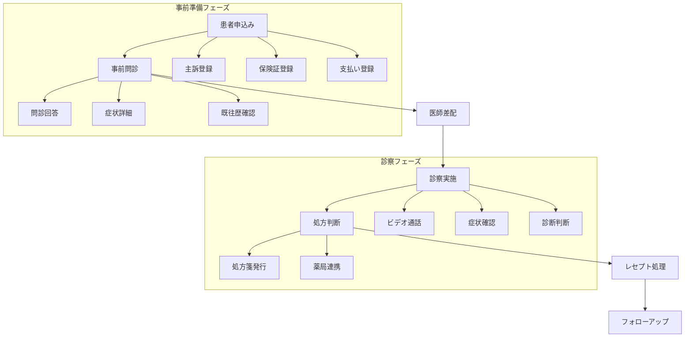
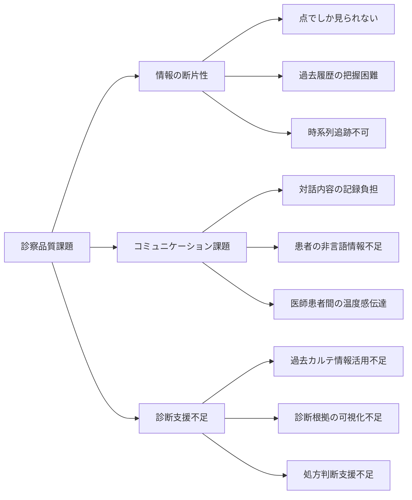
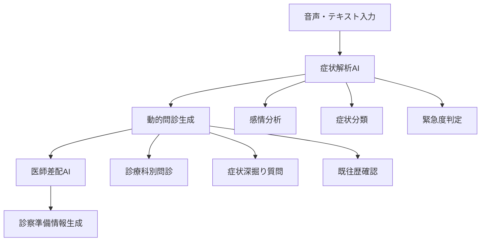

# オンライン診療事業課題サマリ

## 情報整理

このドキュメントは、ファストドクターのオンライン診療事業における主要な課題を、学生の皆さんにとって理解しやすい形で整理したものです。医療DXの実際の課題と、AI技術による解決可能性を示しています。

## オンライン診療の基本的なバリューチェーン

## 事業課題の構造

### マーケティング課題

- 医師採用の困難さ
  - オンライン医師確保のCPA: 約15,000円
  - 診療科別の医師確保競争の激化
  - 専門性を持つ医師の不足

- 診療科拡大の課題
  - 呼吸器内科、メンタル、皮膚科等の拡充ニーズ
  - 各診療科特有の要件対応
  - 医師の専門性と患者ニーズのマッチング

### オペレーション課題

- システム統合の複雑性
  - FDカルテ統合（完了済み）
  - 算定自動化（完了済み）
  - 複数システム間の連携維持

- 繁忙期のボトルネック
  - 大量案件処理の必要性
  - 医師のアイドル時間発生
  - 効率的なリソース配分

### 事前問診課題

| 課題分野                 | 現在の状況               | 問題点                               | 理想的な状態                         | AI活用可能性                                         |
| ------------------------ | ------------------------ | ------------------------------------ | ------------------------------------ | ---------------------------------------------------- |
| 問診内容の深度           | ルールベースでの問診実施 | 患者ごとの機微に応じた質問ができない | 症状に応じた動的な深掘り質問         | 症状別AI問診システム（発熱→感染歴、頭痛→既往歴など） |
| 患者のメンタルリテラシー | 患者の期待値が不明確     | 診察満足度への影響                   | 事前の期待値調整と認識合わせ         | 音声感情分析、期待値マッチングAI                     |
| 医師差配の精度           | 看護師の主観による差配   | 専門性とのミスマッチ                 | 患者症状と医師専門性の最適マッチング | 症状解析による自動医師差配システム                   |
| 情報取得の質             | 定型的な問診項目         | 診察時の情報不足                     | 診察前の詳細な情報収集               | 音声・テキスト問診AI、症状詳細化システム             |
| 診療科別対応             | 汎用的な問診フォーム     | 診療科特有のニーズに未対応           | 診療科別カスタマイズ問診             | 診療科別AI問診エンジン                               |

### 診察(医療)課題

- 診療品質の維持・向上
  - 過去カルテ情報からの200-500文字サマリ生成需要
  - 初診時症状から現在までの変化追跡
  - 医師による診察評価の標準化

- 医療安全・過誤防止
  - オンライン診療特有のリスク管理
  - 薬剤マスタの診療科別表示
  - 禁忌・相互作用の自動チェック

### 処方課題

- 薬剤マスタ管理の複雑性
  - 診療科別の表示要件
  - 処方制限・禁忌情報の管理
  - 他科処方薬との相互作用チェック

- 薬局連携の効率化
  - 処方箋発行の自動化
  - 薬局との情報連携
  - 服薬指導の質向上

### レセプト課題

- 算定自動化（完了済み）
- 診療報酬制度への対応
- 請求処理の効率化と精度向上

## AI活用の可能性

### 事前問診段階でのAI活用

### 診察段階でのAI活用

- 音声からの対話内容自動書き起こし
- 動画からの情報抽出（表情、様子など）
- 過去カルテ情報からの自動サマリ生成
- リアルタイム診断支援

### フォローアップ段階でのAI活用

- 患者不安度合いに応じたフォローアップ提案
- 自動架電システム
- 服薬方法の自動案内
- 症状改善度の追跡

## 医療DXのトリレンマ

オンライン診療では以下の3要素のバランスが重要：

- スピード: 迅速な診察提供
- 医師の専門性: 高度な医療判断
- 医療品質: 安全で確実な診療

AIの活用により、このトリレンマの解決が期待されています。

## 参考情報

- [AIと考えたオンライン診療の医療品質課題](https://www.notion.so/AI-1f458e601d3980debe84d9b1f29a18ef)
- [オンライン診療患者課題リスト](https://www.notion.so/1d658e601d3980b09033c1e0ea772829)
- [Qiitaハッカソン 第二回 ブレスト会](https://www.notion.so/18a58e601d3980eb8465ceec498d4688)

## アーキテクチャ方針

- フロントエンド: React
- バックエンド: Hono（優先）→ 同じOpenAPIスキーマでFastAPI対応
- AWS: Amazon Chimeエンドポイントのみ利用（Lambda、Cognito等は使用しない）
- 認証: 今後検討課題

## 技術実装のフォーカス

今回のハッカソンでは「予約 → 事前問診 → 診察 → 処方」のフローを重点的に扱い、特に音声ストリーミング + 文字起こし + AI解析の統合実装に焦点を当てます。
